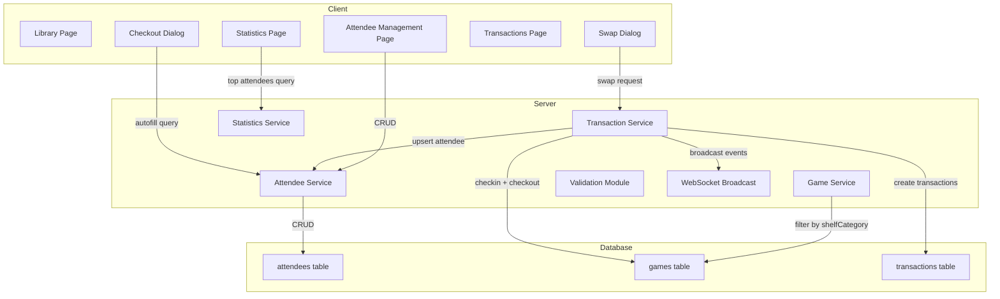

# Design Document: Attendee Tracking, Swaps & Categories

## Overview

This design adds four capabilities to the board game library system:

1. **Attendee Persistence** — A dedicated `attendees` table with upsert-on-checkout semantics and autofill suggestions for fast repeat-attendee identification.
2. **Game Swap Action** — An atomic operation that checks in one game and checks out another to the same attendee in a single database transaction, with WebSocket conflict detection monitoring both games.
3. **Shelf Category Classification** — A new `shelfCategory` field (`family`, `small`, `standard`) orthogonal to the existing prize type, with full filtering/sorting/CSV support.
4. **Rename gameType → prizeType** — Column rename for clarity, with CSV backward compatibility via legacy alias.

The design preserves existing patterns: Drizzle ORM schema, singleton service objects, `ValidationResult<T>` return types, WebSocket broadcast helpers, and the `handleEvent` routing function.

## Architecture



### Key Design Decisions

1. **Attendee upsert on checkout, not on swap separately** — The swap operation reuses the existing checkout service, which handles attendee upsert. No separate attendee logic is needed in the swap path.

2. **Swap as checkin + checkout in one transaction** — Rather than introducing a new transaction type, the swap records a standard `checkin` and `checkout`. This preserves compatibility with existing statistics, transaction log, and weight comparison logic.

3. **Case-insensitive attendee matching via `LOWER()` index** — The unique constraint uses a unique index on `(LOWER(TRIM(first_name)), LOWER(TRIM(last_name)))` for case-insensitive comparison without requiring any PostgreSQL extensions.

4. **`shelfCategory` is independent of `prizeType`** — Both fields coexist on the games table. Filters, sorts, and CSV columns are separate. No coupling between the two classifications.

5. **Swap conflict detection monitors two game IDs** — The existing `handleEvent` pattern checks one `currentEditGameId`. The swap dialog extends this by checking incoming events against both the return game ID and the selected new game ID.

6. **Backup includes attendees automatically** — Since backup uses `pg_dump`/`pg_restore` on the full database, the new `attendees` table is included without additional code.

## Components and Interfaces

### New Service: `attendeeService` (`src/lib/server/services/attendees.ts`)

```typescript
export interface AttendeeRecord {
  id: number;
  firstName: string;
  lastName: string;
  idType: string;
  createdAt: Date;
  updatedAt: Date;
}

export interface AttendeeWithCount extends AttendeeRecord {
  transactionCount: number;
}

export interface AttendeeFilters {
  search?: string;
  idType?: string;
}

export interface AttendeeSortParams {
  field: 'first_name' | 'last_name' | 'id_type' | 'transaction_count';
  direction: 'asc' | 'desc';
}

export const attendeeService = {
  /** Upsert attendee by case-insensitive first+last name match. Returns attendee ID. */
  async upsert(data: { firstName: string; lastName: string; idType: string }): Promise<number>;

  /** Search attendees by prefix (for autofill). Returns max 10 results. */
  async searchByPrefix(query: string, field: 'firstName' | 'lastName'): Promise<AttendeeRecord[]>;

  /** List attendees with filters, pagination, sorting. */
  async list(
    filters?: AttendeeFilters,
    pagination?: PaginationParams,
    sort?: AttendeeSortParams
  ): Promise<PaginatedResult<AttendeeWithCount>>;

  /** Get attendee by ID. */
  async getById(id: number): Promise<AttendeeRecord | null>;

  /** Update attendee fields. Validates uniqueness. */
  async update(id: number, data: { firstName: string; lastName: string; idType: string }): Promise<AttendeeRecord>;

  /** Delete attendee. Rejects if attendee has active checkouts. Cascades transactions. */
  async delete(id: number): Promise<void>;

  /** Get transaction count for an attendee. */
  async getTransactionCount(id: number): Promise<number>;

  /** Check if attendee has active checkouts. */
  async hasActiveCheckouts(id: number): Promise<boolean>;
};
```

### Modified Service: `transactionService`

New method added:

```typescript
/** Atomically swap: checkin returnGame, checkout newGame to same attendee. */
async swap(data: {
  returnGameId: number;
  newGameId: number;
  checkinWeight: number;
  checkoutWeight: number;
}): Promise<{
  checkinTransaction: CheckinTransaction;
  checkoutTransaction: CheckoutTransaction;
  weightWarning?: WeightWarning;
}>;
```

The `checkout` method is modified to accept an optional `attendeeId` parameter and perform the attendee upsert internally (calling `attendeeService.upsert`). The `attendeeId` foreign key is stored on the transaction.

### Modified Service: `gameService`

- `listLibrary` gains a `shelfCategory` filter parameter in `LibraryFilters`
- `LibrarySortParams.field` adds `'shelf_category'`
- `create` and `update` accept optional `shelfCategory` parameter
- All references to `gameType` renamed to `prizeType` in types and queries

### Modified Validation: `validation.ts`

New functions:

```typescript
export interface SwapInput {
  returnGameId: number;
  newGameId: number;
  checkinWeight: number;
  checkoutWeight: number;
}

export function validateSwapInput(input: Partial<SwapInput>): ValidationResult<SwapInput>;

export interface AttendeeInput {
  firstName: string;
  lastName: string;
  idType: string;
}

export function validateAttendeeInput(input: Partial<AttendeeInput>): ValidationResult<AttendeeInput>;
```

Modified functions:
- `validateGameInput` adds optional `shelfCategory` field with validation
- `validateGameInput` renames `gameType` to `prizeType`
- `validateCsvRows` adds `shelfCategory` column support and `prizeType`/`gameType` header handling

### New Component: `SwapDialog.svelte`

```typescript
// Props
let {
  returnGame,  // LibraryGameRecord (the checked-out game being returned)
  open,        // boolean binding
  onSuccess    // callback after successful swap
}: SwapDialogProps = $props();
```

The dialog:
- Displays return game info and attendee details (read-only)
- Provides a paginated, searchable list of available games (fetched via a dedicated `GET /api/games/available?q=...&page=...&pageSize=10` endpoint that returns lightweight records: id, title, bggId, copyNumber)
- Uses a compact pagination element for navigating the available games list
- Accepts checkin weight (return game) and checkout weight (new game)
- Monitors WebSocket events for both game IDs
- Disables submit on conflict detection

### New Component: `AttendeeAutofill.svelte`

A reusable autofill/typeahead component:

```typescript
let {
  value,       // string binding for the input value
  field,       // 'firstName' | 'lastName'
  onSelect,    // callback when suggestion is selected
  placeholder
}: AttendeeAutofillProps = $props();
```

Uses debounced fetch to `/api/attendees/search?q=...&field=...` endpoint.

### WebSocket Events

New event types added:

```typescript
export type EventType =
  | ... // existing types
  | 'attendee_created'
  | 'attendee_updated'
  | 'attendee_deleted';

export interface AttendeeEventMessage {
  type: 'attendee_created' | 'attendee_updated' | 'attendee_deleted';
  attendeeId: number;
}
```

New broadcast helper:

```typescript
export function broadcastAttendeeEvent(
  type: AttendeeEventMessage['type'],
  attendeeId: number
): void;
```

The `LIVE_UPDATE_PAGES` array adds `/management/attendees`. This page reacts to `attendee_created`, `attendee_updated`, and `attendee_deleted` events by calling `invalidateAll()` to refresh the attendee list, consistent with how the library and games list pages handle their respective events.

### New API Endpoint: `/api/attendees/search`

```
GET /api/attendees/search?q={query}&field={firstName|lastName}
Response: { suggestions: AttendeeRecord[] }
```

Returns max 10 results using case-insensitive prefix matching. Requires minimum 2-character query.

### New API Endpoint: `/api/games/available`

```
GET /api/games/available?q={titleSearch}&page={page}&pageSize={pageSize}
Response: { games: { id: number; title: string; bggId: number; copyNumber: number }[], total: number }
```

Returns a paginated list of currently available games with lightweight fields (no full metadata). Used exclusively by the Swap Dialog. Default page size is 10. The `q` parameter filters by title using case-insensitive partial matching.

### New Pages

- `/management/attendees/+page.svelte` — Attendee list with search, filter, sort, pagination
- `/management/attendees/[id]/+page.svelte` — Attendee edit form
- `/management/attendees/+page.server.ts` — Load function + delete action
- `/management/attendees/[id]/+page.server.ts` — Load function + update action

## Data Models

### New Table: `attendees`

```typescript
export const attendees = pgTable(
  'attendees',
  {
    id: serial('id').primaryKey(),
    firstName: text('first_name').notNull(),
    lastName: text('last_name').notNull(),
    idType: text('id_type').notNull(),
    createdAt: timestamp('created_at', { withTimezone: true }).notNull().defaultNow(),
    updatedAt: timestamp('updated_at', { withTimezone: true }).notNull().defaultNow()
  },
  (table) => [
    // Case-insensitive unique constraint on trimmed name combination
    index('idx_attendees_name_unique')
      .on(sql`LOWER(TRIM(${table.firstName}))`, sql`LOWER(TRIM(${table.lastName}))`)
      .unique(),
    index('idx_attendees_first_name').on(table.firstName),
    index('idx_attendees_last_name').on(table.lastName)
  ]
);
```

Note: `updatedAt` is maintained explicitly in service code (setting `updatedAt: new Date()` on every update call), consistent with the existing `games` table pattern. No database trigger is used.

### Modified Table: `transactions`

```typescript
// Add column:
attendeeId: integer('attendee_id').references(() => attendees.id, { onDelete: 'cascade' })
```

### Modified Table: `games`

```typescript
// Rename column:
prizeType: text('prize_type').notNull().default('standard'),  // was game_type

// Add column:
shelfCategory: text('shelf_category').notNull().default('standard'),

// Add index:
index('idx_games_shelf_category').on(table.shelfCategory)
```

### Migration Plan

Two migrations in sequence:

**Migration 1: Rename gameType → prizeType**
```sql
ALTER TABLE games RENAME COLUMN game_type TO prize_type;
ALTER INDEX idx_games_game_type RENAME TO idx_games_prize_type;
```

**Migration 2: Add attendees table, shelfCategory, attendeeId FK**
```sql
CREATE TABLE attendees (
  id SERIAL PRIMARY KEY,
  first_name TEXT NOT NULL,
  last_name TEXT NOT NULL,
  id_type TEXT NOT NULL,
  created_at TIMESTAMPTZ NOT NULL DEFAULT NOW(),
  updated_at TIMESTAMPTZ NOT NULL DEFAULT NOW()
);

CREATE UNIQUE INDEX idx_attendees_name_unique
  ON attendees (LOWER(TRIM(first_name)), LOWER(TRIM(last_name)));
CREATE INDEX idx_attendees_first_name ON attendees (first_name);
CREATE INDEX idx_attendees_last_name ON attendees (last_name);

ALTER TABLE games ADD COLUMN shelf_category TEXT NOT NULL DEFAULT 'standard';
CREATE INDEX idx_games_shelf_category ON games (shelf_category);

ALTER TABLE transactions ADD COLUMN attendee_id INTEGER REFERENCES attendees(id) ON DELETE CASCADE;
CREATE INDEX idx_transactions_attendee_id ON transactions (attendee_id);
```

## Correctness Properties

*A property is a characteristic or behavior that should hold true across all valid executions of a system — essentially, a formal statement about what the system should do. Properties serve as the bridge between human-readable specifications and machine-verifiable correctness guarantees.*

### Property 1: Attendee name length validation

*For any* string with length greater than 100 characters used as a first name or last name, the attendee validation SHALL reject the input. *For any* string with length between 1 and 100 characters (after trimming), the validation SHALL accept it.

**Validates: Requirements 1.1**

### Property 2: Attendee upsert correctness (case-insensitive create-or-update)

*For any* attendee first name and last name combination, performing a checkout with that name (regardless of case or leading/trailing whitespace) SHALL always resolve to the same attendee record. If the attendee does not exist, a new record is created. If it already exists (matched case-insensitively after trimming), the existing record's ID type is updated and the same attendee ID is returned.

**Validates: Requirements 1.2, 1.4, 1.5**

### Property 3: Corrections skip attendee upsert

*For any* transaction where `isCorrection` is true, the attendee table SHALL remain unchanged — no new attendee records are created and no existing records are updated.

**Validates: Requirements 1.6**

### Property 4: Autofill prefix matching

*For any* set of attendee records and any query string of 2+ characters, all returned suggestions SHALL have a first name or last name that starts with the query string (case-insensitively), and the result set SHALL contain at most 10 entries.

**Validates: Requirements 2.3**

### Property 5: Swap weight validation

*For any* swap input, the checkin weight and checkout weight SHALL each be validated as a positive finite number greater than zero. Non-positive, zero, non-finite, or non-numeric values SHALL be rejected.

**Validates: Requirements 3.5**

### Property 6: Swap atomicity and correctness

*For any* valid swap (return game is checked out, new game is available), after the swap completes: (a) the return game status SHALL be `available`, (b) the new game status SHALL be `checked_out`, (c) exactly one `checkin` transaction exists for the return game with the provided checkin weight, (d) exactly one `checkout` transaction exists for the new game with the provided checkout weight, and (e) the checkout transaction's attendee information SHALL match the return game's original checkout attendee information.

**Validates: Requirements 3.6, 3.7, 3.8**

### Property 7: Swap precondition validation

*For any* game that is not in `checked_out` status used as the return game, the swap SHALL be rejected. *For any* game that is not in `available` status used as the new game, the swap SHALL be rejected. In both cases, no state changes occur.

**Validates: Requirements 3.10, 3.11**

### Property 8: Shelf category validation

*For any* string value provided as a `shelfCategory`, the game validation SHALL accept it if and only if it is one of `family`, `small`, or `standard`. All other values SHALL be rejected with a validation error.

**Validates: Requirements 4.1, 4.4, 4.5**

### Property 9: Shelf category filtering

*For any* set of games with various shelf categories and any selected shelf category filter value, the filtered results SHALL contain only games whose `shelfCategory` matches the filter value.

**Validates: Requirements 4.8**

### Property 10: CSV shelf category round-trip

*For any* valid game with a shelf category value, exporting to CSV and re-importing SHALL preserve the shelf category. *For any* CSV row with an invalid shelf category value, the import SHALL be rejected with an error identifying the row.

**Validates: Requirements 4.10, 4.11, 4.12**

### Property 11: CSV prizeType/gameType backward compatibility

*For any* valid CSV import, the system SHALL accept both `prizeType` and `gameType` as column headers and produce the same result. The exported CSV SHALL use `prizeType` as the header.

**Validates: Requirements 5.5**

### Property 12: Shelf category and prize type independence

*For any* game, updating the `shelfCategory` SHALL NOT change the `prizeType` value, and updating the `prizeType` SHALL NOT change the `shelfCategory` value.

**Validates: Requirements 4.13**

### Property 13: Swap conflict detection (two-game monitoring)

*For any* WebSocket event with a `gameId` matching either the return game ID or the selected new game ID, the swap dialog conflict handler SHALL return a conflict action. Events with game IDs not matching either game SHALL not trigger a conflict.

**Validates: Requirements 6.2, 6.5**

### Property 14: Attendee statistics exclude corrections

*For any* set of transactions including both standard checkouts and correction transactions, the attendee checkout count SHALL equal the count of non-correction checkout transactions only.

**Validates: Requirements 8.4**

### Property 15: Attendee search partial matching

*For any* set of attendee records and any search string, all returned attendees SHALL have a first name or last name that contains the search string (case-insensitively).

**Validates: Requirements 9.3**

### Property 16: Attendee edit uniqueness validation

*For any* attendee edit that would result in a first name + last name combination matching another existing attendee (case-insensitively), the edit SHALL be rejected with a validation error.

**Validates: Requirements 9.9**

### Property 17: Attendee deletion blocked by active checkouts

*For any* attendee who has at least one game currently in `checked_out` status linked to them via a checkout transaction, deletion SHALL be rejected.

**Validates: Requirements 9.11**

## Error Handling

| Scenario | Response | User Feedback |
|----------|----------|---------------|
| Swap: return game not checked out | `fail(409, { error })` | Error toast: "Return game is not currently checked out" |
| Swap: new game not available | `fail(409, { error })` | Error toast: "Selected game is not available" |
| Swap: optimistic locking conflict on new game | `fail(409, { conflict: true })` | Conflict warning in dialog |
| Swap: WebSocket conflict detected | Disable submit button | Warning banner in dialog |
| Attendee autofill: service error | Suppress suggestions silently | No error shown; manual entry continues |
| Attendee edit: duplicate name | `fail(400, { errors })` | Inline validation error on name fields |
| Attendee delete: active checkouts | `fail(400, { error })` | Error toast: "Attendee has active checkouts" |
| Invalid shelfCategory | `fail(400, { errors })` | Inline validation error on field |
| CSV import: invalid shelfCategory | Reject entire import | Error message identifying invalid row |
| Attendee name > 100 chars | `fail(400, { errors })` | Inline validation error on name field |

All errors follow the existing pattern: form actions return `fail(statusCode, { errors, values })` for validation errors and `fail(409, { conflict })` for optimistic locking conflicts.

## Testing Strategy

Testing is a first-class requirement (Requirement 11). All new features must have both property-based tests validating correctness properties and E2E tests validating user flows.

### Property-Based Tests (fast-check)

New test files:

| File | Properties Covered |
|------|-------------------|
| `attendee-validation.prop.test.ts` | Properties 1, 2, 3, 16, 17 |
| `swap-validation.prop.test.ts` | Properties 5, 6, 7 |
| `shelf-category.prop.test.ts` | Properties 8, 9, 12 |
| `csv-shelf-category.prop.test.ts` | Properties 10, 11 |
| `swap-conflict.prop.test.ts` | Property 13 |
| `attendee-search.prop.test.ts` | Properties 4, 15 |
| `attendee-statistics.prop.test.ts` | Property 14 |

Each property test uses `fc.assert(fc.property(...))` with minimum 100 iterations. Each test includes a JSDoc comment referencing the design property:

```typescript
/**
 * Feature: attendee-tracking-swaps-categories, Property 2: Attendee upsert correctness
 * For any attendee name combination, checkout always resolves to the same attendee record
 * regardless of case or whitespace.
 */
```

### Unit Tests (example-based)

- Swap dialog renders with correct pre-selected return game
- Autofill shows no suggestions for < 2 characters
- Autofill gracefully handles service errors
- Default shelfCategory is `standard` for new games
- CSV export includes shelfCategory column
- Statistics page shows top 10 attendees section
- Attendee management page pagination defaults

### E2E Integration Tests (Playwright)

New test files:

| File | Coverage |
|------|----------|
| `swap.test.ts` | Full swap flow, weight warning, conflict detection |
| `attendee-autofill.test.ts` | Autofill on checkout, library filter, transactions filter |
| `attendee-management.test.ts` | CRUD, search, delete with cascade, active checkout prevention |
| `shelf-category.test.ts` | Create/edit with category, filter, sort, CSV import/export |
| `prize-type-rename.test.ts` | Verify existing game type functionality under new name |

### Testing Configuration

- Property tests: `npm run test` (Vitest, single run via `vitest run`)
- E2E tests: `npm run test:e2e` (Docker + Playwright)
- All property tests use fast-check with default `numRuns` (100)
- Mock `$app/navigation` where needed for service imports
- Custom arbitraries for attendee names, shelf categories, game states
- Existing tests referencing `gameType` must be updated to use `prizeType` (Requirement 11.7)
