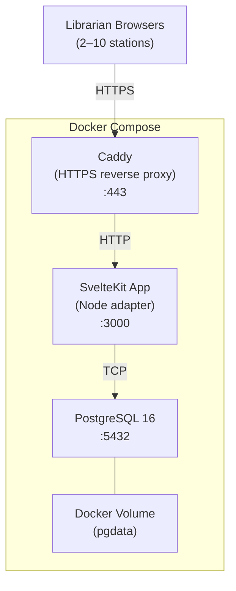
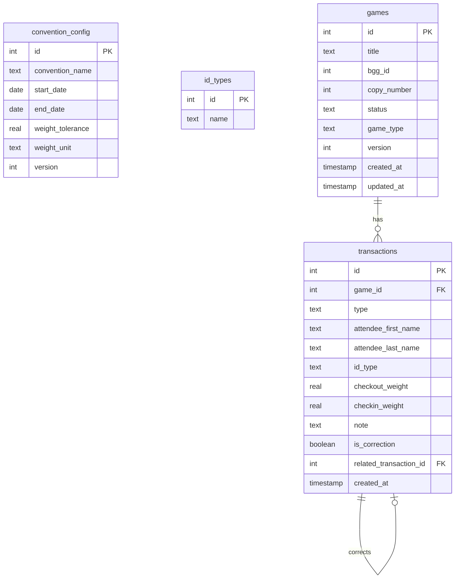

# Design Document: Board Game Library

## Overview

The Board Game Library is a LAN-based web application for managing board game checkouts and returns at conventions. It runs as a Docker-composed stack of three services — Caddy (HTTPS reverse proxy), SvelteKit (TypeScript full-stack app), and PostgreSQL — on a single commodity machine serving 2–10 librarian stations.

The system provides:
- Game catalog management with soft-delete (retire/restore), multiple copies per title, and three game types (standard, play_and_win, play_and_take)
- Checkout/checkin workflows with attendee tracking, weight verification, optimistic locking, and optional notes
- A transaction log for auditing with error-correction (reversal) capabilities
- Statistics dashboard with multi-dimensional filtering (time range, time of day, convention day, game title, attendee, status, game type, BGG title grouping)
- Management area with robust filtering, sorting, and bulk operations
- Convention configuration (name, dates, weight tolerance/unit, ID types)
- Data backup/restore (full PostgreSQL dump) and CSV import/export
- Responsive UI with persistent navbar (tablet/desktop) and hamburger menu (mobile)
- Pagination across all list views
- Seed data with 10 example games on first run

No authentication is required. All timestamps use server local time.

## Architecture

### High-Level Architecture



### Request Flow

1. Librarian browser connects to Caddy over HTTPS (self-signed TLS)
2. Caddy terminates TLS and proxies to SvelteKit on internal port 3000
3. SvelteKit handles routing, SSR, form actions, and API endpoints
4. Server-side code uses Drizzle ORM to query/mutate PostgreSQL
5. SSR renders pages and streams HTML to the client; client-side hydration enables interactivity

### Technology Decisions

| Layer | Technology | Rationale |
|-------|-----------|-----------|
| Reverse Proxy | Caddy 2 | Auto-generates self-signed TLS certs, zero-config HTTPS |
| Application | SvelteKit (Node adapter) | Full-stack TypeScript, SSR, form actions, file-based routing |
| ORM | Drizzle ORM | Type-safe schema, lightweight, PostgreSQL-native, migration support |
| Database | PostgreSQL 16 | Robust relational DB, ACID transactions, JSON support |
| Notifications | svelte-french-toast | Lightweight toast notifications for success, error, and warning popups |
| Testing (Unit/PBT) | Vitest + fast-check | Fast unit tests and property-based testing |
| Testing (Integration) | Playwright | Browser-based end-to-end testing against the full stack |
| CSV Parsing | PapaParse | Robust CSV parsing/generation with quoted fields, BOM handling |
| Package Manager | npm | Per requirements |
| Containerization | Docker + docker-compose | Single-command deployment |

### Project Structure

```
board-game-library/
├── docker-compose.yml
├── Caddyfile
├── Dockerfile
├── package.json
├── tsconfig.json
├── svelte.config.js
├── vite.config.ts
├── drizzle.config.ts
├── drizzle/                    # Generated migration files
│   └── migrations/
├── src/
│   ├── app.html
│   ├── app.css
│   ├── hooks.server.ts         # Server hooks (migration runner)
│   ├── lib/
│   │   ├── server/
│   │   │   ├── db/
│   │   │   │   ├── index.ts        # Drizzle client instance
│   │   │   │   ├── schema.ts       # All table definitions
│   │   │   │   └── seed.ts         # Seed data (10 example games)
│   │   │   ├── services/
│   │   │   │   ├── games.ts        # Game CRUD logic
│   │   │   │   ├── transactions.ts # Checkout/checkin/reversal logic
│   │   │   │   ├── statistics.ts   # Statistics aggregation queries
│   │   │   │   ├── config.ts       # Convention configuration logic
│   │   │   │   ├── backup.ts       # DB export/import logic
│   │   │   │   └── csv.ts          # CSV import/export logic
│   │   │   └── validation.ts       # Shared validation schemas
│   │   ├── components/
│   │   │   ├── Navbar.svelte
│   │   │   ├── Pagination.svelte
│   │   │   ├── SearchFilter.svelte
│   │   │   ├── ConfirmDialog.svelte
│   │   │   ├── WeightWarning.svelte
│   │   │   ├── GameTypeBadge.svelte
│   │   │   └── FilterPanel.svelte
│   │   ├── stores/
│   │   │   └── pagination.ts       # Pagination state helpers
│   │   └── utils/
│   │       ├── formatting.ts       # Date, duration, weight formatting
│   │       └── validation.ts       # Client-side validation helpers
│   └── routes/
│       ├── +layout.svelte          # Root layout (Navbar, convention name, Toaster)
│       ├── +layout.server.ts       # Load convention config for layout
│       ├── checkout/
│       │   ├── +page.svelte
│       │   └── +page.server.ts
│       ├── checkin/
│       │   ├── +page.svelte
│       │   └── +page.server.ts
│       ├── catalog/
│       │   ├── +page.svelte
│       │   └── +page.server.ts
│       ├── statistics/
│       │   ├── +page.svelte
│       │   └── +page.server.ts
│       ├── management/
│       │   ├── +page.svelte        # Game list with filters
│       │   ├── +page.server.ts
│       │   ├── games/
│       │   │   ├── new/
│       │   │   │   ├── +page.svelte
│       │   │   │   └── +page.server.ts
│       │   │   └── [id]/
│       │   │       ├── +page.svelte
│       │   │       └── +page.server.ts
│       │   ├── transactions/
│       │   │   ├── +page.svelte
│       │   │   └── +page.server.ts
│       │   ├── config/
│       │   │   ├── +page.svelte
│       │   │   └── +page.server.ts
│       │   ├── backup/
│       │   │   ├── +page.svelte
│       │   │   └── +page.server.ts
│       │   └── csv/
│       │       ├── +page.svelte
│       │       └── +page.server.ts
│       └── api/
│           └── backup/
│               └── export/
│                   └── +server.ts  # Streaming DB dump download
```


## Components and Interfaces

### Server-Side Services

Each service module in `src/lib/server/services/` encapsulates domain logic and database queries. SvelteKit `+page.server.ts` files call these services from `load` functions and form actions.

#### Game Service (`games.ts`)

```typescript
interface GameService {
  // CRUD
  create(data: { title: string; bggId: number; gameType: GameType }): Promise<GameRecord>;
  update(id: number, data: Partial<GameUpdateInput>): Promise<GameRecord>;
  retire(ids: number[]): Promise<void>;
  restore(id: number): Promise<void>;

  // Queries
  getById(id: number): Promise<GameRecord | null>;
  list(filters: GameFilters, pagination: PaginationParams, sort: SortParams): Promise<PaginatedResult<GameRecord>>;
  listAvailable(search?: string, pagination?: PaginationParams): Promise<PaginatedResult<GameRecord>>;
  listCheckedOut(search?: string, pagination?: PaginationParams): Promise<PaginatedResult<GameRecord>>;

  // Status toggle (manual override)
  toggleStatus(id: number, newStatus: 'available' | 'checked_out', version: number): Promise<GameRecord>;
}
```

#### Transaction Service (`transactions.ts`)

```typescript
interface TransactionService {
  // Checkout with optimistic locking
  checkout(data: {
    gameId: number;
    gameVersion: number;  // for optimistic locking
    attendeeFirstName: string;
    attendeeLastName: string;
    idType: string;
    checkoutWeight: number;
    note?: string;
  }): Promise<CheckoutTransaction>;

  // Checkin with weight comparison
  checkin(data: {
    gameId: number;
    checkinWeight: number;
    note?: string;
    attendeeTakesGame?: boolean;  // for play_and_take
  }): Promise<{ transaction: CheckinTransaction; weightWarning?: WeightWarning }>;

  // Reversal
  reverseCheckout(transactionId: number): Promise<void>;
  reverseCheckin(transactionId: number): Promise<void>;

  // Queries
  list(filters: TransactionFilters, pagination: PaginationParams): Promise<PaginatedResult<Transaction>>;
}
```

#### Statistics Service (`statistics.ts`)

```typescript
interface StatisticsService {
  getStatistics(filters: StatisticsFilters): Promise<{
    totalCheckouts: number;
    currentCheckedOut: number;
    currentAvailable: number;
    avgCheckoutsPerDay: number;
    avgCheckoutDuration: Duration;
    minCheckoutDuration: Duration;
    maxCheckoutDuration: Duration;
    longestCumulativeGame: { gameId: number; title: string; totalDuration: Duration };
    topGames: PaginatedResult<{ title: string; checkoutCount: number }>;
    durationDistribution: { bucket: string; count: number }[];
  }>;
}

interface StatisticsFilters {
  timeRange?: { start: Date; end: Date };
  timeOfDay?: { startHour: number; endHour: number };
  conventionDay?: number;
  gameTitle?: string;
  attendeeName?: string;
  availabilityStatus?: 'available' | 'checked_out';
  gameType?: GameType;
  groupByBggTitle?: boolean;
}
```

#### Config Service (`config.ts`)

```typescript
interface ConfigService {
  get(): Promise<ConventionConfig>;
  update(data: ConventionConfigInput): Promise<ConventionConfig>;
  getIdTypes(): Promise<string[]>;
  addIdType(name: string): Promise<void>;
  removeIdType(id: number): Promise<void>;
}
```

#### Backup Service (`backup.ts`)

```typescript
interface BackupService {
  exportDatabase(): Promise<ReadableStream>;  // pg_dump stream
  importDatabase(file: File): Promise<void>;  // pg_restore
}
```

#### CSV Service (`csv.ts`)

Uses PapaParse for robust CSV parsing and generation (handles quoted fields, BOM, newlines in values).

```typescript
interface CsvService {
  validateImport(fileContent: string): Promise<{ valid: boolean; errors: { row: number; message: string }[]; rowCount: number }>;
  importGames(fileContent: string): Promise<{ created: number }>;
  exportGames(): Promise<string>;  // CSV string via Papa.unparse()
}
```

### Frontend Components

#### Navbar (`Navbar.svelte`)
- Persistent horizontal bar on tablet/desktop with links: Checkout, Checkin, Catalog, Statistics, Management
- On mobile: Checkout and Checkin visible; Management, Catalog, Statistics, Configuration behind hamburger menu
- Highlights active page
- Displays convention name from config

#### Pagination (`Pagination.svelte`)
- Props: `totalItems`, `currentPage`, `pageSize`, `pageSizeOptions`
- Emits page change and page size change events
- Shows total result count, page numbers, prev/next buttons

#### SearchFilter (`SearchFilter.svelte`)
- Real-time text input with debounce (300ms)
- Emits search term changes
- Used on checkout, checkin, catalog, management, statistics, and transaction log pages

#### ConfirmDialog (`ConfirmDialog.svelte`)
- Modal dialog with configurable title, message, and confirm/cancel buttons
- Supports warning messages (e.g., checked-out games in bulk retire)

#### WeightWarning (`WeightWarning.svelte`)
- Dismissible alert shown when checkin weight differs from checkout weight beyond tolerance
- Shows both weights, the difference, and the configured tolerance

#### GameTypeBadge (`GameTypeBadge.svelte`)
- Visual badge displaying game type (standard, play_and_win, play_and_take)
- Color-coded for quick identification

#### FilterPanel (`FilterPanel.svelte`)
- Composable filter panel used in management area and statistics page
- Supports: text search, dropdown selects, date pickers, toggles
- Emits combined filter state on any change

### SvelteKit Page Architecture

Each page follows the SvelteKit pattern:
- `+page.server.ts`: Exports `load` function (data fetching with filters/pagination from URL params) and `actions` object (form submissions for mutations)
- `+page.svelte`: Renders UI using data from `load`, submits forms to `actions`

#### Checkout Page (`/checkout`)
- `load`: Fetches available games with optional search filter, paginated
- `actions.checkout`: Validates input, calls `transactionService.checkout()` with optimistic locking
- UI: Search bar, game list with type badges, checkout form (attendee name, ID type, weight, optional note)

#### Checkin Page (`/checkin`)
- `load`: Fetches checked-out games with attendee info and checkout duration, paginated
- `actions.checkin`: Validates input, calls `transactionService.checkin()`, returns weight warning if applicable
- UI: Search bar (by title or attendee name), game list with attendee info, checkin form (weight, optional note), play_and_win reminder, play_and_take prompt

#### Catalog Page (`/catalog`)
- `load`: Fetches all non-retired games with filters (status, game type, search), paginated
- UI: Filter bar, game list with BGG links, status indicators, type badges

#### Statistics Page (`/statistics`)
- `load`: Fetches aggregated statistics with all active filters
- UI: Filter panel (time range, time of day, convention day, game title, attendee, status, game type, BGG grouping toggle), metric cards, ranked game list, duration distribution

#### Management Pages
- `/management`: Game list with advanced filters, bulk select, retire/restore actions
- `/management/games/new`: Add game form (title, BGG ID, game type)
- `/management/games/[id]`: Edit game form, status toggle
- `/management/transactions`: Transaction log with filters, reversal actions
- `/management/config`: Convention configuration form
- `/management/backup`: Database export/import
- `/management/csv`: CSV import/export


## Data Models

### Database Schema (Drizzle ORM)



### Table Definitions

#### `convention_config`

| Column | Type | Constraints | Description |
|--------|------|-------------|-------------|
| id | serial | PK | Always row 1 (singleton) |
| convention_name | text | not null, default '' | Convention display name |
| start_date | date | nullable | Convention start date |
| end_date | date | nullable | Convention end date |
| weight_tolerance | real | not null, default 0.5 | Acceptable weight difference threshold |
| weight_unit | text | not null, default 'oz' | Weight unit: 'oz', 'kg', or 'g' |
| version | integer | not null, default 1 | Optimistic locking version |

#### `id_types`

| Column | Type | Constraints | Description |
|--------|------|-------------|-------------|
| id | serial | PK | Auto-increment ID |
| name | text | not null, unique | ID type name (e.g., "Driver's License") |

#### `games`

| Column | Type | Constraints | Description |
|--------|------|-------------|-------------|
| id | serial | PK | Auto-increment ID |
| title | text | not null | Game title |
| bgg_id | integer | not null | Board Game Geek ID (positive integer) |
| copy_number | integer | not null | Auto-generated sequential copy number per BGG ID |
| status | text | not null, default 'available' | 'available', 'checked_out', or 'retired' |
| game_type | text | not null, default 'standard' | 'standard', 'play_and_win', or 'play_and_take' |
| version | integer | not null, default 1 | Optimistic locking version counter |
| created_at | timestamp | not null, default now() | Record creation time (server local) |
| updated_at | timestamp | not null, default now() | Last update time (server local) |

Indexes:
- `idx_games_bgg_id` on `bgg_id` — fast lookup for copy numbering and BGG title grouping
- `idx_games_status` on `status` — fast filtering by availability
- `idx_games_game_type` on `game_type` — fast filtering by game type

#### `transactions`

| Column | Type | Constraints | Description |
|--------|------|-------------|-------------|
| id | serial | PK | Auto-increment ID |
| game_id | integer | not null, FK → games.id | Associated game |
| type | text | not null | 'checkout' or 'checkin' |
| attendee_first_name | text | nullable | Attendee first name (checkout only) |
| attendee_last_name | text | nullable | Attendee last name (checkout only) |
| id_type | text | nullable | ID type given as collateral (checkout only) |
| checkout_weight | real | nullable | Weight at checkout |
| checkin_weight | real | nullable | Weight at checkin |
| note | text | nullable | Optional free-text note |
| is_correction | boolean | not null, default false | Whether this is a corrective/reversal transaction |
| related_transaction_id | integer | nullable, FK → transactions.id | Links correction to original transaction |
| created_at | timestamp | not null, default now() | Transaction timestamp (server local) |

Indexes:
- `idx_transactions_game_id` on `game_id` — fast lookup by game
- `idx_transactions_type` on `type` — fast filtering by transaction type
- `idx_transactions_created_at` on `created_at` — fast time-range queries
- `idx_transactions_attendee` on `(attendee_first_name, attendee_last_name)` — fast attendee search

### Drizzle Schema Definition

```typescript
// src/lib/server/db/schema.ts
import { pgTable, serial, text, integer, real, boolean, timestamp, date, index, uniqueIndex } from 'drizzle-orm/pg-core';

export const conventionConfig = pgTable('convention_config', {
  id: serial('id').primaryKey(),
  conventionName: text('convention_name').notNull().default(''),
  startDate: date('start_date'),
  endDate: date('end_date'),
  weightTolerance: real('weight_tolerance').notNull().default(0.5),
  weightUnit: text('weight_unit').notNull().default('oz'),
  version: integer('version').notNull().default(1),
});

export const idTypes = pgTable('id_types', {
  id: serial('id').primaryKey(),
  name: text('name').notNull().unique(),
});

export const games = pgTable('games', {
  id: serial('id').primaryKey(),
  title: text('title').notNull(),
  bggId: integer('bgg_id').notNull(),
  copyNumber: integer('copy_number').notNull(),
  status: text('status').notNull().default('available'),
  gameType: text('game_type').notNull().default('standard'),
  version: integer('version').notNull().default(1),
  createdAt: timestamp('created_at').notNull().defaultNow(),
  updatedAt: timestamp('updated_at').notNull().defaultNow(),
}, (table) => [
  index('idx_games_bgg_id').on(table.bggId),
  index('idx_games_status').on(table.status),
  index('idx_games_game_type').on(table.gameType),
]);

export const transactions = pgTable('transactions', {
  id: serial('id').primaryKey(),
  gameId: integer('game_id').notNull().references(() => games.id),
  type: text('type').notNull(),
  attendeeFirstName: text('attendee_first_name'),
  attendeeLastName: text('attendee_last_name'),
  idType: text('id_type'),
  checkoutWeight: real('checkout_weight'),
  checkinWeight: real('checkin_weight'),
  note: text('note'),
  isCorrection: boolean('is_correction').notNull().default(false),
  relatedTransactionId: integer('related_transaction_id').references(() => transactions.id),
  createdAt: timestamp('created_at').notNull().defaultNow(),
}, (table) => [
  index('idx_transactions_game_id').on(table.gameId),
  index('idx_transactions_type').on(table.type),
  index('idx_transactions_created_at').on(table.createdAt),
  index('idx_transactions_attendee').on(table.attendeeFirstName, table.attendeeLastName),
]);
```

### Optimistic Locking Strategy

The `games` table includes a `version` column. The checkout flow:

1. Page loads game list; each game row includes its current `version`
2. Librarian selects a game and fills checkout form
3. Form submission sends `gameId` + `version` to the server
4. Server executes within a transaction:
   ```sql
   UPDATE games SET status = 'checked_out', version = version + 1, updated_at = now()
   WHERE id = $gameId AND status = 'available' AND version = $version
   ```
5. If `rowCount === 0`, another station already checked it out → return conflict error
6. If `rowCount === 1`, proceed to create the `Checkout_Transaction`

### Copy Number Generation

When creating a new game, the system auto-generates the copy number:

```sql
SELECT COALESCE(MAX(copy_number), 0) + 1 FROM games WHERE bgg_id = $bggId
```

This runs inside the same transaction as the INSERT to prevent race conditions.

### Seed Data

On first startup (when `games` table is empty), the system inserts 10 example games:

| Title | BGG ID | Copies | Game Type |
|-------|--------|--------|-----------|
| Catan | 13 | 2 | standard |
| Ticket to Ride | 9209 | 2 | standard |
| Pandemic | 30549 | 1 | standard |
| Azul | 230802 | 1 | standard |
| Codenames | 178900 | 1 | play_and_win |
| Wingspan | 266192 | 1 | standard |
| 7 Wonders | 68448 | 1 | play_and_take |
| Splendor | 148228 | 1 | standard |

This provides 10 Game_Records total (Catan ×2, Ticket to Ride ×2, plus 6 singles), includes multiple copies of the same title, and demonstrates all three game types.


## Correctness Properties

*A property is a characteristic or behavior that should hold true across all valid executions of a system — essentially, a formal statement about what the system should do. Properties serve as the bridge between human-readable specifications and machine-verifiable correctness guarantees.*

### Property 1: Game record validation rejects invalid input

*For any* game creation or update input where the title is empty/whitespace or the BGG_ID is not a positive integer, the system SHALL reject the operation and return a validation error without modifying the database.

**Validates: Requirements 1.2, 1.3, 1.4, 2.2, 2.3**

### Property 2: Checkout validation rejects incomplete input

*For any* checkout attempt where any required field (attendee first name, attendee last name, ID type, or checkout weight) is missing or where checkout weight is not a positive number, the system SHALL reject the checkout and return a validation error identifying the missing/invalid fields.

**Validates: Requirements 4.4, 4.5, 4.6, 4.7, 4.8**

### Property 3: Checkin validation rejects missing or invalid weight

*For any* checkin attempt where the checkin weight is missing or not a positive number, the system SHALL reject the checkin and return a validation error.

**Validates: Requirements 5.5, 5.8**

### Property 4: Game status state machine transitions

*For any* game with status "available", a checkout SHALL transition it to "checked_out"; *for any* game with status "checked_out", a checkin SHALL transition it to "available"; *for any* game that is not "available", a checkout SHALL be rejected; *for any* game that is not "checked_out", a checkin SHALL be rejected.

**Validates: Requirements 4.1, 4.2, 5.1, 5.2**

### Property 5: Optimistic locking rejects stale versions

*For any* checkout attempt where the provided game version does not match the current version in the database, the system SHALL reject the checkout with a conflict error, leaving the game status unchanged.

**Validates: Requirements 4.13**

### Property 6: Transaction data round-trip

*For any* successful checkout, the stored Checkout_Transaction SHALL contain the exact attendee first name, attendee last name, ID type, checkout weight, and note that were provided as input. *For any* successful checkin, the stored Checkin_Transaction SHALL contain the exact checkin weight and note that were provided as input.

**Validates: Requirements 4.9, 4.15, 5.6, 5.13**

### Property 7: Weight warning correctness

*For any* checkout weight, checkin weight, and weight tolerance (all positive numbers), the system SHALL produce a weight warning if and only if the absolute difference between checkout weight and checkin weight exceeds the weight tolerance.

**Validates: Requirements 5.7**

### Property 8: Retire/restore round-trip

*For any* game with status "available", retiring it and then restoring it SHALL result in the game having status "available". The game record and all its associated transactions SHALL be preserved throughout both operations.

**Validates: Requirements 3.1, 3.8, 3.9**

### Property 9: Retired games excluded from checkout and checkin views

*For any* set of games with mixed statuses, querying the checkout view SHALL return only games with status "available", and querying the checkin view SHALL return only games with status "checked_out". No retired games SHALL appear in either view.

**Validates: Requirements 3.5, 4.10, 5.9**

### Property 10: Transaction log chronological ordering

*For any* set of transactions in the log, the returned list SHALL be ordered by timestamp in descending order (most recent first).

**Validates: Requirements 7.1**

### Property 11: Filter predicate correctness

*For any* filter criteria (status, game type, title substring, attendee name, transaction type) applied to any list view, every item in the result set SHALL satisfy the filter predicate, and no item satisfying the predicate SHALL be excluded from the result set.

**Validates: Requirements 6.2, 6.3, 6.4, 7.3, 7.4, 7.5, 12.6, 13.1**

### Property 12: Combined filters produce intersection

*For any* combination of two or more filters applied simultaneously, the result set SHALL equal the intersection of the result sets produced by each filter applied individually.

**Validates: Requirements 12.18, 13.9**

### Property 13: Sort ordering correctness

*For any* sort field (title, BGG_ID, status, game type, last transaction date) applied to the management area game list, the returned items SHALL be ordered according to the selected field and direction.

**Validates: Requirements 13.5**

### Property 14: Copy number sequential uniqueness

*For any* BGG_ID, the copy numbers assigned to games with that BGG_ID SHALL be sequential positive integers starting from 1, with no gaps or duplicates.

**Validates: Requirements 11.2**

### Property 15: Transaction reversal restores status and creates corrective record

*For any* checkout reversal on a currently checked-out game, the game status SHALL change to "available" and a corrective Checkin_Transaction with `is_correction=true` SHALL be created. *For any* checkin reversal on a currently available game, the game status SHALL change to "checked_out" and a corrective Checkout_Transaction with `is_correction=true` SHALL be created. *For any* reversal that conflicts with the current game status, the system SHALL reject the reversal.

**Validates: Requirements 8.1, 8.2, 8.3**

### Property 16: Statistics duration metrics use only completed pairs

*For any* set of transactions including both completed checkout-checkin pairs and incomplete checkouts (no corresponding checkin), the duration metrics (average, min, max, distribution) SHALL be calculated using only completed pairs. Currently checked-out games with no checkin SHALL be excluded from duration calculations.

**Validates: Requirements 12.16, 12.19**

### Property 17: Play-and-take checkin behavior

*For any* game with game_type "play_and_take", if the attendee chooses to take the game during checkin, the game status SHALL change to "retired" and a note SHALL be recorded. If the attendee does not take the game, the game status SHALL change to "available" (normal checkin).

**Validates: Requirements 20.7, 20.8**

### Property 18: BGG URL format

*For any* game with a BGG_ID, the generated BGG link SHALL be exactly `https://boardgamegeek.com/boardgame/{BGG_ID}` where `{BGG_ID}` is the integer value stored on the game record.

**Validates: Requirements 9.1**

### Property 19: Convention configuration validation

*For any* configuration submission where the end date is earlier than the start date, or the weight tolerance is not a positive number, the system SHALL reject the submission with a validation error.

**Validates: Requirements 14.6, 14.7**

### Property 20: CSV validation reports all errors

*For any* CSV file containing rows with missing titles, invalid BGG_IDs, or non-positive copy counts, the system SHALL report every error in the file without importing any records.

**Validates: Requirements 19.2, 19.3**

### Property 21: CSV export completeness

*For any* set of games in the database, the exported CSV SHALL contain one row per game record with the correct title, BGG_ID, copy identifier, and status.

**Validates: Requirements 19.6**

### Property 22: Pagination returns correct subset

*For any* list of N items, page number P, and page size S, the paginated result SHALL contain items from index `(P-1)*S` to `min(P*S, N)-1` (zero-indexed) of the full sorted/filtered list, and the total count SHALL equal N.

**Validates: Requirements 16.1, 16.4**


## Error Handling

### Validation Errors

All user input is validated on the server side in `+page.server.ts` form actions. Validation failures return SvelteKit `fail()` responses with structured error objects:

```typescript
return fail(400, {
  errors: { title: 'Title is required', bggId: 'BGG ID must be a positive integer' }
});
```

Client-side validation provides immediate feedback but is never trusted — the server is the source of truth.

### Concurrency Conflicts (Optimistic Locking)

When a checkout fails due to a stale version:
1. Server returns `fail(409, { conflict: true, message: 'This game was just checked out by another station.' })`
2. Client displays the conflict message and refreshes the game list via `invalidateAll()`
3. The game disappears from the available list since it's now checked_out

### Transaction Reversal Conflicts

When a reversal conflicts with the current game status:
1. Server checks current game status before applying reversal
2. If status doesn't match expectations (e.g., reversing a checkout on an already-checked-in game), returns `fail(409, { conflict: true, message: '...' })`
3. Client displays the conflict explanation

### Database Errors

- Connection failures: SvelteKit error page with "Database unavailable" message
- Constraint violations (e.g., unique copy number race): Caught and retried once, then returned as a 500 error
- Transaction rollback: All multi-step operations (checkout, checkin, reversal, bulk retire) use database transactions. On any failure, the entire operation rolls back.

### File Upload Errors

- CSV Import: File is fully validated before any records are created. All errors are collected and returned as a list. No partial imports.
- Database Import: File is validated as a valid PostgreSQL dump before restoring. Invalid files are rejected with an error message.
- File size: Reasonable limits enforced (e.g., 10MB for CSV, 100MB for database dump)

### Weight Warning (Non-Blocking)

The weight discrepancy warning during checkin is explicitly non-blocking:
1. Server calculates the weight difference and returns it alongside the successful checkin result
2. Client displays a dismissible `WeightWarning` component
3. The checkin is already complete — the warning is informational only

### Network Errors

SvelteKit's built-in error handling catches fetch failures. The root `+error.svelte` page displays a user-friendly message with a retry option.

## Testing Strategy

### Dual Testing Approach

The project uses both unit tests and property-based tests for comprehensive coverage:

- **Unit tests** (Vitest): Specific examples, edge cases, integration points, UI component behavior
- **Property-based tests** (fast-check + Vitest): Universal properties across generated inputs

### Property-Based Testing Configuration

- Library: [fast-check](https://github.com/dubzzz/fast-check) with Vitest
- Minimum iterations: 100 per property test
- Each property test references its design document property with a tag comment:
  ```typescript
  // Feature: board-game-library, Property 7: Weight warning correctness
  ```
- Tag format: `Feature: board-game-library, Property {number}: {property_text}`

### Test Organization

```
src/
├── lib/
│   └── server/
│       ├── services/
│       │   ├── __tests__/
│       │   │   ├── games.test.ts           # Unit + property tests for game CRUD
│       │   │   ├── transactions.test.ts     # Unit + property tests for checkout/checkin
│       │   │   ├── statistics.test.ts       # Unit + property tests for aggregation
│       │   │   ├── config.test.ts           # Unit + property tests for config validation
│       │   │   ├── csv.test.ts              # Unit + property tests for CSV import/export
│       │   │   └── backup.test.ts           # Integration tests for DB export/import
│       │   └── ...
│       └── validation.test.ts              # Property tests for shared validation
├── routes/
│   └── __tests__/                          # Integration tests for page load/actions
└── ...
tests/
├── properties/
│   ├── game-validation.prop.test.ts        # Properties 1, 14, 18
│   ├── transaction-validation.prop.test.ts # Properties 2, 3, 6
│   ├── state-machine.prop.test.ts          # Properties 4, 5, 15
│   ├── weight-warning.prop.test.ts         # Property 7
│   ├── retire-restore.prop.test.ts         # Properties 8, 9
│   ├── filtering.prop.test.ts              # Properties 10, 11, 12, 13
│   ├── statistics.prop.test.ts             # Property 16
│   ├── game-types.prop.test.ts             # Property 17
│   ├── config-validation.prop.test.ts      # Property 19
│   ├── csv.prop.test.ts                    # Properties 20, 21
│   └── pagination.prop.test.ts             # Property 22
└── integration/                            # Playwright end-to-end tests
    ├── checkout-flow.test.ts               # End-to-end checkout scenarios
    ├── checkin-flow.test.ts                # End-to-end checkin scenarios
    └── backup-restore.test.ts              # Database export/import round-trip
```

### Property Test Coverage Map

| Property | Test File | What It Tests |
|----------|-----------|---------------|
| P1 | game-validation.prop.test.ts | Title/BGG_ID validation rejects invalid input |
| P2 | transaction-validation.prop.test.ts | Checkout requires all fields |
| P3 | transaction-validation.prop.test.ts | Checkin requires positive weight |
| P4 | state-machine.prop.test.ts | Status transitions follow state machine |
| P5 | state-machine.prop.test.ts | Stale version rejected |
| P6 | transaction-validation.prop.test.ts | Input data stored and retrievable |
| P7 | weight-warning.prop.test.ts | Warning iff |diff| > tolerance |
| P8 | retire-restore.prop.test.ts | Retire then restore = available |
| P9 | retire-restore.prop.test.ts | Retired excluded from views |
| P10 | filtering.prop.test.ts | Chronological ordering |
| P11 | filtering.prop.test.ts | Filter predicate correctness |
| P12 | filtering.prop.test.ts | Combined filters = intersection |
| P13 | filtering.prop.test.ts | Sort ordering |
| P14 | game-validation.prop.test.ts | Copy numbers sequential and unique |
| P15 | state-machine.prop.test.ts | Reversal restores status |
| P16 | statistics.prop.test.ts | Duration uses completed pairs only |
| P17 | game-types.prop.test.ts | Play-and-take behavior |
| P18 | game-validation.prop.test.ts | BGG URL format |
| P19 | config-validation.prop.test.ts | Config date/weight validation |
| P20 | csv.prop.test.ts | CSV error reporting |
| P21 | csv.prop.test.ts | CSV export completeness |
| P22 | pagination.prop.test.ts | Correct page subset |

### Unit Test Focus Areas

- Specific checkout/checkin scenarios with concrete data
- Edge cases: empty database, single game, maximum concurrent users
- Error correction workflows (reversal chains)
- Seed data verification (correct BGG_IDs, game types, copy counts)
- UI component rendering (Navbar responsive behavior, GameTypeBadge colors)
- Play & Win reminder display, Play & Take dialog flow

### Integration Test Focus Areas (Playwright)

Integration tests use Playwright for browser-based end-to-end testing against a running instance of the full stack:

- Full checkout → checkin flow through the browser UI
- Database backup export → import round-trip on fresh instance
- Concurrent checkout attempts from multiple browser contexts
- CSV import → export round-trip
- Migration runner on startup
- Caddy → SvelteKit → PostgreSQL connectivity (Docker smoke test)
- Responsive navigation behavior (mobile vs desktop viewports)
- Toast notification display for success/error/warning states
