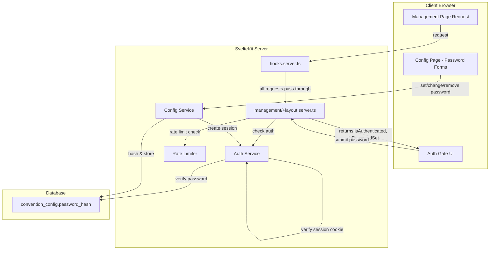

# Design Document: Management Password Protection

## Overview

This feature adds optional password protection to all management routes (`/management/**`) and the `/api/backup/export` endpoint. The design introduces a new auth service for password hashing, session management, and rate limiting, with an inline auth gate on the management layout rather than a separate login page.

The system uses bcrypt for password hashing, HMAC-signed cookies for sessions (no database-backed sessions), and in-memory rate limiting with progressive delays. The password hash is stored as a nullable column on the existing `convention_config` singleton row — `null` means no password is set and management is freely accessible.

### Key Design Decisions

1. **Nullable column on convention_config** rather than a separate auth table — the password is a convention-level setting, not a user account. A single nullable column keeps the model simple.
2. **HMAC-signed cookie** rather than database sessions — avoids a new table, avoids cleanup jobs, and is sufficient for a single-password system on a LAN. The cookie contains an expiry timestamp and an HMAC signature; the server verifies both on each request.
3. **Inline auth gate** rather than a redirect to `/login` — the management layout server load checks auth state and passes it to the layout component, which renders either the password prompt or the child content. This avoids redirect loops and keeps the URL stable.
4. **In-memory rate limiting** keyed by IP — acceptable for a single-instance LAN app. Rate limit state is lost on restart, which is fine since it only affects brute-force mitigation.
5. **bcrypt** via `bcryptjs` (pure JS, no native bindings) to avoid Docker build complexity.
6. **Random ephemeral secret fallback** — if `AUTH_SECRET` is not set, the server generates a random secret on startup and logs a warning. This means sessions invalidate on restart, but with a 30-minute window that's acceptable for a LAN convention app. This avoids the risk of a deterministic fallback being forgeable by anyone who knows the `DATABASE_URL`.
7. **Layout data propagation** — child pages (backup, games, config) access `isPasswordSet` from the management layout's load data via `$page.data` rather than re-querying the config. This avoids redundant database calls and keeps the auth state consistent.
8. **Password hash exclusion** — `configService.get()` returns `ConventionConfig` without the hash field. A separate `getPasswordHash()` method provides server-only access to the hash. This split makes it structurally impossible for the hash to leak to the client through a load function.
9. **Cookie security settings** — the session cookie uses `httpOnly: true`, `sameSite: 'lax'`, `path: '/'`, `secure: false` (LAN HTTP). The `path: '/'` ensures the cookie is sent for both `/management` routes and `/api/backup/export`.

## Architecture



### Request Flow

1. Browser requests a management route
2. `management/+layout.server.ts` load function runs:
   - Reads `password_hash` from config
   - If null → pass `{ isPasswordSet: false, isAuthenticated: true }` to layout
   - If set → check for valid session cookie via auth service
   - If valid session → pass `{ isPasswordSet: true, isAuthenticated: true }`
   - If no valid session → pass `{ isPasswordSet: true, isAuthenticated: false }`
3. Layout component renders auth gate or child content based on these flags
4. Auth gate form POST is handled by a layout action that verifies the password, applies rate limiting, and sets the session cookie on success
5. For `/api/backup/export`, the `+server.ts` handler checks auth directly before streaming the export

## Components and Interfaces

### Auth Service (`src/lib/server/services/auth.ts`)

Singleton service handling password operations, session management, and rate limiting.

```typescript
interface AuthService {
  // Password operations
  hashPassword(plaintext: string): Promise<string>;
  verifyPassword(plaintext: string, hash: string): Promise<boolean>;

  // Session cookie operations
  createSessionCookie(): string;
  verifySessionCookie(cookieValue: string): boolean;

  // Rate limiting
  getRateLimitDelay(clientIp: string): number;
  recordFailedAttempt(clientIp: string): void;
  resetRateLimit(clientIp: string): void;
}
```

**Password hashing**: Uses `bcryptjs` with a cost factor of 10 (standard for interactive logins).

**Session cookie format**: `{expiryTimestamp}.{hmacSignature}`
- `expiryTimestamp`: Unix epoch milliseconds when the session expires (creation time + 30 minutes)
- `hmacSignature`: HMAC-SHA256 of the expiry timestamp string, using a server secret
- The server secret is read from the `AUTH_SECRET` environment variable. If not set, a random secret is generated on startup using `crypto.randomBytes(32)` and a warning is logged. This means sessions will not survive server restarts when `AUTH_SECRET` is not configured, which is acceptable for a LAN convention app.

**Session cookie settings**:
- `httpOnly: true` — prevents client-side JavaScript from reading the cookie
- `sameSite: 'lax'` — standard CSRF protection
- `path: '/'` — ensures the cookie is sent for both `/management` routes and `/api/backup/export`
- `secure: false` — the app runs over plain HTTP on a LAN

**Rate limiting**: In-memory `Map<string, { attempts: number; lastAttempt: number }>` keyed by client IP.
- Delay formula: `min(attempts * 1000, 5000)` ms — 1s after first failure, 2s after second, up to 5s max
- Entries expire after 15 minutes of inactivity (cleaned up lazily on access)
- Reset to 0 on successful authentication
- The delay is applied as an async `await new Promise(resolve => setTimeout(resolve, delay))` — this does NOT block the Node.js event loop, it only delays the response for that specific request
- **NAT caveat**: On a shared convention LAN behind NAT, all clients may share an IP. This means one person's failed attempts could slow down everyone. This is acceptable for the convention use case where the password is typically known by a small group of organizers.

### Config Service Changes (`src/lib/server/services/config.ts`)

The existing `configService.get()` method and `ConventionConfig` interface need updating to prevent the password hash from leaking to the client.

**Approach: Split `get()` from `getPasswordHash()`**

The `ConventionConfig` interface (used as the return type of `get()` and consumed by load functions) MUST NOT include `passwordHash`. Instead:

```typescript
// ConventionConfig stays as-is (no passwordHash field) — safe to return to client
interface ConventionConfig {
  id: number;
  conventionName: string;
  startDate: string | null;
  endDate: string | null;
  weightTolerance: number;
  weightUnit: string;
  version: number;
}

// New method: server-only, returns just the hash (or null)
async getPasswordHash(): Promise<string | null>;

// New password management methods
async setPassword(hash: string): Promise<void>;
async changePassword(newHash: string): Promise<void>;
async removePassword(): Promise<void>;
```

- `get()` continues to return `ConventionConfig` without the hash. Internally, the Drizzle query either uses a column projection to exclude `password_hash`, or the method strips it before returning.
- `getPasswordHash()` is a separate method that queries only the `password_hash` column. This is used by the management layout server and auth-related actions.
- `setPassword()`, `changePassword()`, and `removePassword()` update only the `password_hash` column (they do NOT increment the optimistic locking `version` since password changes are independent of config changes).

This split ensures the hash can never accidentally reach the client through a load function that returns `configService.get()`.

### Password Validation (`src/lib/server/validation.ts`)

New validation functions added to the existing validation module:

```typescript
interface PasswordInput {
  password: string;
  confirmation: string;
}

function validatePasswordInput(input: PasswordInput): ValidationResult<{ password: string }>;

interface PasswordChangeInput {
  currentPassword: string;
  newPassword: string;
  newPasswordConfirmation: string;
}

function validatePasswordChangeInput(input: PasswordChangeInput): ValidationResult<{ currentPassword: string; newPassword: string }>;
```

Validation rules:
- Password must not be empty or whitespace-only
- Password and confirmation must match
- No minimum length requirement beyond non-empty (convention organizer's choice)

### Management Layout Server (`src/routes/management/+layout.server.ts`)

New file. Handles auth state for all management routes. Child pages (backup, games, config) access `isPasswordSet` from this layout's load data via `$page.data` rather than re-querying the config.

```typescript
// Load function
export const load: LayoutServerLoad = async ({ cookies, url }) => {
  const passwordHash = await configService.getPasswordHash();

  if (!passwordHash) {
    return { isPasswordSet: false, isAuthenticated: true };
  }

  const isAuthenticated = authService.verifySessionCookie(
    cookies.get('mgmt_session') ?? ''
  );

  return { isPasswordSet: true, isAuthenticated };
};

// Actions
export const actions: Actions = {
  login: async ({ request, cookies, getClientAddress }) => {
    // Rate limit check (async delay, not blocking), password verification, session cookie creation
  }
};
```

**Important**: The `passwordHash` value is used server-side only and MUST NOT be included in any data returned to the client. Only the boolean `isPasswordSet` flag is sent to the browser.

### Management Layout Component (`src/routes/management/+layout.svelte`)

New file. Wraps all management pages with an auth gate.

```svelte
<script lang="ts">
  import type { Snippet } from 'svelte';
  let { data, children }: { data: LayoutData; children: Snippet } = $props();
</script>

{#if data.isAuthenticated}
  {@render children()}
{:else}
  <!-- Auth gate: password input form -->
{/if}
```

### Config Page Password Section

The config page (`+page.svelte`) gains a new section that renders conditionally:
- **No password set**: "Set Password" form (password + confirmation)
- **Password set**: "Change Password" form (current + new + confirmation) and "Remove Password" form (current password)

The config page accesses `isPasswordSet` from the management layout's load data (available via `$page.data`), so it does not need to re-query the config for auth state. Since `configService.get()` no longer returns the password hash (see Config Service Changes above), the existing load function is safe to use as-is.

New form actions on `config/+page.server.ts`:
- `setPassword`: Validates input, hashes password, stores hash, creates session cookie
- `changePassword`: Validates current password, validates new password input, updates hash
- `removePassword`: Validates current password, sets hash to null

### Backup Page Changes

The backup page gains:
- A warning message about password hash replacement during restore (always visible in the import section)
- A password confirmation field in the restore confirmation dialog (only when password is set)
- The `import` action on `backup/+page.server.ts` checks password confirmation when a password is set

### Games Page Changes

The CSV import flow gains:
- A password confirmation field in the CSV import confirmation dialog (only when password is set)
- The `csvImport` action on `games/+page.server.ts` checks password confirmation when a password is set

### Backup Export Endpoint

`src/routes/api/backup/export/+server.ts` gains an auth check:
- Read config to check if password is set
- If set, verify session cookie from the request
- If not authenticated, return 401

### Password Reset Script (`scripts/reset-password.js`)

Standalone Node.js script that connects to PostgreSQL using `DATABASE_URL` and sets `password_hash` to null.

```javascript
// scripts/reset-password.js
import pg from 'pg';
const { Client } = pg;

const client = new Client({ connectionString: process.env.DATABASE_URL });
await client.connect();
await client.query('UPDATE convention_config SET password_hash = NULL WHERE id = 1');
await client.end();
console.log('Password has been cleared. Management pages are now accessible without a password.');
```

## Data Models

### Schema Change: `convention_config` table

Add a nullable `password_hash` text column:

```typescript
// In src/lib/server/db/schema.ts
export const conventionConfig = pgTable('convention_config', {
  id: serial('id').primaryKey(),
  conventionName: text('convention_name').notNull().default(''),
  startDate: date('start_date'),
  endDate: date('end_date'),
  weightTolerance: real('weight_tolerance').notNull().default(0.5),
  weightUnit: text('weight_unit').notNull().default('oz'),
  passwordHash: text('password_hash'),  // NEW: nullable, null = no password
  version: integer('version').notNull().default(1)
});
```

A Drizzle migration will add this column. Since it's nullable with a default of null, no data migration is needed.

### Session Cookie

Not stored in the database. Format: `{expiryMs}.{hmacHex}`

Example: `1719500000000.a1b2c3d4e5f6...`

### Rate Limit State (in-memory)

```typescript
interface RateLimitEntry {
  attempts: number;
  lastAttempt: number; // Unix timestamp ms
}

// Map<clientIp, RateLimitEntry>
```

## Correctness Properties

*A property is a characteristic or behavior that should hold true across all valid executions of a system — essentially, a formal statement about what the system should do. Properties serve as the bridge between human-readable specifications and machine-verifiable correctness guarantees.*

### Property 1: Password hashing round-trip

*For any* non-empty, non-whitespace password string, hashing it with `hashPassword` and then verifying the original string against the hash with `verifyPassword` SHALL return `true`.

**Validates: Requirements 1.1, 1.3, 3.1**

### Property 2: Wrong password rejection

*For any* two distinct non-empty password strings `p1` and `p2`, hashing `p1` and then verifying `p2` against that hash SHALL return `false`.

**Validates: Requirements 6.3, 7.4, 10.3**

### Property 3: Password confirmation mismatch rejection

*For any* two distinct non-empty strings submitted as password and confirmation, `validatePasswordInput` SHALL return `valid: false` with an error on the confirmation field.

**Validates: Requirements 3.2, 6.4**

### Property 4: Empty/whitespace password rejection

*For any* string composed entirely of whitespace characters (including the empty string), `validatePasswordInput` SHALL return `valid: false` with an error on the password field.

**Validates: Requirements 3.3, 6.5**

### Property 5: Session cookie creation sets expiry 30 minutes from now

*For any* point in time, a session cookie created at that time SHALL contain an expiry timestamp exactly 30 minutes (1,800,000 ms) in the future.

**Validates: Requirements 5.1**

### Property 6: Expired sessions are rejected

*For any* session cookie whose expiry timestamp is in the past, `verifySessionCookie` SHALL return `false`.

**Validates: Requirements 5.2**

### Property 7: HMAC tamper detection

*For any* valid session cookie string, modifying any character in the cookie value SHALL cause `verifySessionCookie` to return `false`.

**Validates: Requirements 5.3, 5.4**

### Property 8: Rate limiter delay monotonicity

*For any* two failure counts `a` and `b` where `a < b`, the rate limit delay for `b` consecutive failures SHALL be greater than or equal to the delay for `a` consecutive failures, and the delay for any count >= 1 SHALL be greater than 0.

**Validates: Requirements 8.1, 8.2**

### Property 9: Rate limiter reset on success

*For any* client IP with a positive failure count, calling `resetRateLimit` SHALL result in `getRateLimitDelay` returning 0 for that IP.

**Validates: Requirements 8.3**

### Property 10: Valid password input acceptance

*For any* non-empty, non-whitespace string `p`, calling `validatePasswordInput({ password: p, confirmation: p })` SHALL return `valid: true` with `data.password` equal to `p`.

**Validates: Requirements 3.1, 6.2**

## Error Handling

### Password Operations
- **Wrong current password** on change/remove: Return `fail(400, { passwordError: 'Current password is incorrect' })`. Do not reveal whether a password is set via error messages.
- **Validation errors** (empty password, mismatch): Return `fail(400, { passwordErrors: { field: message } })` with field-level errors, same pattern as existing config validation.
- **bcrypt failure**: Catch and return `fail(500, { passwordError: 'An error occurred. Please try again.' })`. Log the actual error server-side.

### Session Operations
- **Invalid/expired cookie**: Silently treat as unauthenticated. No error message — just show the auth gate.
- **Missing AUTH_SECRET**: Generate a random secret on startup using `crypto.randomBytes(32)`. Log a warning recommending `AUTH_SECRET` be set for session persistence across restarts. Sessions will not survive server restarts without it.

### Rate Limiting
- **Rate limited request**: Apply an async `await new Promise(resolve => setTimeout(resolve, delay))` before responding. This delays only the specific request without blocking the Node.js event loop. The client sees a slower response, not an error code. This prevents timing-based information leakage.

### Backup Restore
- **Wrong password confirmation**: Return `fail(400, { error: 'Incorrect password' })`. Do not proceed with restore.
- **Password hash replacement warning**: Informational only — the restore proceeds if password is confirmed. The warning is displayed in the UI before confirmation.

### Password Reset Script
- **No DATABASE_URL**: Print error to stderr, exit with code 1.
- **Connection failure**: Print error to stderr, exit with code 1.
- **No config row**: Print warning that no config exists, exit with code 0 (idempotent).

## Testing Strategy

### Property-Based Tests (fast-check + Vitest)

File: `tests/properties/auth.prop.test.ts`

Tests the auth service's pure logic functions in isolation. Each test runs a minimum of 100 iterations.

| Property | What it tests | Generators |
|----------|--------------|------------|
| 1: Password hashing round-trip | `hashPassword` → `verifyPassword` returns true | Random non-whitespace strings (1-72 chars, bcrypt max) |
| 2: Wrong password rejection | `hashPassword(p1)` → `verifyPassword(p2)` returns false | Pairs of distinct non-whitespace strings |
| 3: Confirmation mismatch rejection | `validatePasswordInput` rejects mismatched pairs | Pairs of distinct non-empty strings |
| 4: Empty/whitespace rejection | `validatePasswordInput` rejects whitespace-only | Whitespace-only strings (spaces, tabs, newlines) |
| 5: Session expiry timing | Cookie expiry = creation time + 30 min | Random timestamps |
| 6: Expired session rejection | Past-expiry cookies are rejected | Cookies with past timestamps |
| 7: HMAC tamper detection | Modified cookies are rejected | Valid cookies with single-char mutations |
| 8: Rate limiter monotonicity | Delay increases with failure count | Pairs of integers (a < b) |
| 9: Rate limiter reset | Delay returns to 0 after reset | Random failure counts |
| 10: Valid password acceptance | Matching non-empty pairs are accepted | Non-whitespace strings |

Tag format: `Feature: management-password-protection, Property N: {title}`

### E2E Integration Tests (Playwright)

File: `tests/integration/password-protection.test.ts`

Tests the full authentication flow through the running app:

1. **No password set**: Management pages accessible without auth prompt
2. **Set password**: Set password from config page, verify session is created
3. **Auth gate**: Clear cookies, visit management page, verify auth gate appears
4. **Login**: Submit correct password, verify access granted
5. **Wrong password**: Submit wrong password, verify error message
6. **Session persistence**: After login, navigate between management pages without re-prompting
7. **Password change**: Change password from config page, verify new password works
8. **Password removal**: Remove password, verify management pages accessible without auth
9. **Backup restore confirmation**: With password set, verify restore requires password confirmation
10. **CSV import confirmation**: With password set, verify CSV import requires password confirmation
11. **Backup export protection**: With password set, verify unauthenticated export returns 401
12. **Backup restore warning**: Verify warning about password hash replacement is displayed

### Unit Tests (Vitest)

Covered by property-based tests above. No additional example-based unit tests needed beyond what the properties cover, except:
- One example test verifying the password reset script SQL is correct (mock the pg client)

## File Changes Summary

### New Files
| File | Purpose |
|------|---------|
| `src/lib/server/services/auth.ts` | Auth service: password hashing, session cookies, rate limiting |
| `src/routes/management/+layout.server.ts` | Management layout server: auth check load + login action |
| `src/routes/management/+layout.svelte` | Management layout: auth gate UI wrapper |
| `scripts/reset-password.js` | Password reset CLI script |
| `tests/properties/auth.prop.test.ts` | Property-based tests for auth logic |
| `tests/integration/password-protection.test.ts` | E2E tests for full auth flow |

### Modified Files
| File | Changes |
|------|---------|
| `src/lib/server/db/schema.ts` | Add `passwordHash` column to `conventionConfig` |
| `src/lib/server/validation.ts` | Add `validatePasswordInput`, `validatePasswordChangeInput` |
| `src/lib/server/services/config.ts` | Split `get()` to exclude hash from `ConventionConfig`; add `getPasswordHash`, `setPassword`, `changePassword`, `removePassword` methods |
| `src/routes/management/config/+page.server.ts` | Add `setPassword`, `changePassword`, `removePassword` actions; pass `isPasswordSet` to page |
| `src/routes/management/config/+page.svelte` | Add password management section (set/change/remove forms) |
| `src/routes/management/backup/+page.server.ts` | Add password confirmation check to `import` action; pass `isPasswordSet` |
| `src/routes/management/backup/+page.svelte` | Add password confirmation field to restore dialog; add password hash warning |
| `src/routes/management/games/+page.server.ts` | Add password confirmation check to `csvImport` action; pass `isPasswordSet` |
| `src/routes/management/games/+page.svelte` | Add password confirmation field to CSV import dialog |
| `src/routes/api/backup/export/+server.ts` | Add auth check before streaming export |
| `package.json` | Add `bcryptjs` dependency |
| `.env.example` | Add `AUTH_SECRET` variable |

### New Migration
| File | Purpose |
|------|---------|
| `drizzle/migrations/XXXX_add_password_hash.sql` | `ALTER TABLE convention_config ADD COLUMN password_hash TEXT;` |
