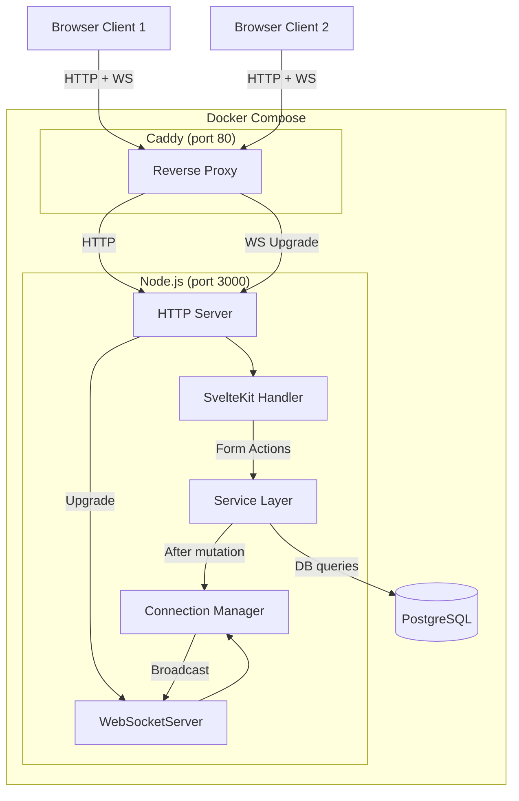

# Design Document: Real-Time Game Updates

## Overview

This feature adds WebSocket-based real-time update propagation to the Board Game Library so that game mutations (checkout, checkin, creation, editing, retirement, restoration, CSV import, status toggle) and transaction mutations are automatically pushed to all connected browser clients. This eliminates the need for librarians to manually refresh their browsers to see changes made by other stations.

The design uses the `ws` library for server-to-client broadcasting over native WebSocket connections. The server maintains an in-memory set of connections and broadcasts lightweight JSON event messages after each mutation. Clients on "live update" pages respond by calling SvelteKit's `invalidateAll()` to reload server data in place, while clients on "static" pages ignore events entirely. A special `full_resync` event after database restore triggers a full page reload on all clients.

### Key Design Decisions

1. **`ws` over Socket.IO**: We only need server-to-client broadcasting. `ws` is zero-dependency and battle-tested. Socket.IO would add ~45KB to the client bundle for features we won't use.
2. **Hook into adapter-node's generated server**: SvelteKit does not have native WebSocket support (issue #1491). Rather than creating a custom HTTP server from scratch, `server.js` imports the generated `build/index.js` entry point (which exports `{ host, path, port, server }`) and layers WebSocket support on top via the `upgrade` event. This preserves all adapter-node features: graceful shutdown (SIGTERM/SIGINT handling, connection draining with configurable `SHUTDOWN_TIMEOUT`), keep-alive timeout (`KEEP_ALIVE_TIMEOUT`), headers timeout (`HEADERS_TIMEOUT`), request tracking for idle connection management, and socket activation support.
3. **`noServer` mode for WebSocket**: Both the production `server.js` and the Vite dev plugin create the `WebSocketServer` with `{ noServer: true }` and manually handle the HTTP `upgrade` event, filtering by the `/ws` path. This avoids conflicts with Vite's HMR WebSocket in development and cleanly separates our WebSocket from other upgrade requests in production.
4. **Dedicated `/ws` path**: All WebSocket connections use the `/ws` endpoint. Clients connect to `ws(s)://host/ws`. This distinguishes our app's WebSocket from other upgrade requests, avoids Vite HMR conflicts, and is easier to debug in browser network tools.
5. **Vite plugin for dev mode**: A Vite plugin hooks into the dev server's `httpServer` to attach WebSocket support during development, using `noServer` mode to coexist with Vite's HMR WebSocket.
6. **Native browser WebSocket API**: No client library needed. We implement reconnection with exponential backoff (1s–30s) ourselves.
7. **In-memory connection set**: A simple `Set<WebSocket>` in the Node.js process. Broadcasting is a direct function call from the service/action layer — no IPC needed.
8. **Caddy**: Already handles WebSocket proxying via Upgrade headers — no Caddyfile changes required.

## Architecture



### Data Flow

1. A librarian submits a form action (e.g., checkout a game)
2. SvelteKit form action calls the service layer (e.g., `transactionService.checkout()`)
3. The service performs the database mutation
4. The form action calls `broadcast()` from the Connection Manager with the appropriate event type and game/transaction ID
5. The Connection Manager iterates over all active WebSocket connections and sends the JSON event message
6. Each connected client receives the event, and if on a Live_Update_Page, calls `invalidateAll()` (debounced) to reload server data
7. The originating client also receives the event and reloads, which is harmless since `invalidateAll()` is idempotent

## Components and Interfaces

### Server-Side Components

#### 1. Connection Manager (`src/lib/server/ws/connection-manager.ts`)

The central module for WebSocket connection tracking and event broadcasting.

```typescript
interface ConnectionManager {
  /** Register a new WebSocket connection */
  addConnection(ws: WebSocket): void;

  /** Remove a closed/errored WebSocket connection */
  removeConnection(ws: WebSocket): void;

  /** Broadcast an event message to all active connections */
  broadcast(event: EventMessage): void;

  /** Get the count of active connections (for monitoring/debugging) */
  getConnectionCount(): number;
}
```

Implementation details:
- Stores connections in a `Set<WebSocket>`
- On `broadcast()`, iterates the set and calls `ws.send(JSON.stringify(event))` for each connection
- Connections with `readyState !== WebSocket.OPEN` are skipped and removed
- Singleton instance exported for use by form actions and services

#### 2. Event Message Types (`src/lib/server/ws/events.ts`)

```typescript
type EventType =
  | 'game_created'
  | 'game_updated'
  | 'game_checked_out'
  | 'game_checked_in'
  | 'game_retired'
  | 'game_restored'
  | 'games_imported'
  | 'games_batch_changed'
  | 'transaction_created'
  | 'full_resync';

interface GameEventMessage {
  type: Exclude<EventType, 'games_batch_changed' | 'transaction_created' | 'full_resync'>;
  gameId: number;
}

interface BatchGameEventMessage {
  type: 'games_batch_changed';
  gameIds: number[];
}

interface TransactionEventMessage {
  type: 'transaction_created';
  transactionId: number;
  gameId: number;
}

interface FullResyncMessage {
  type: 'full_resync';
}

type EventMessage =
  | GameEventMessage
  | BatchGameEventMessage
  | TransactionEventMessage
  | FullResyncMessage;
```

#### 3. Broadcast Helper Functions (`src/lib/server/ws/broadcast.ts`)

Convenience functions that form actions call after mutations:

```typescript
/** Broadcast a single game change event */
function broadcastGameEvent(type: GameEventMessage['type'], gameId: number): void;

/** Broadcast a batch game change event (CSV import, bulk retire) */
function broadcastBatchGameEvent(gameIds: number[]): void;

/** Broadcast a transaction creation event */
function broadcastTransactionEvent(transactionId: number, gameId: number): void;

/** Broadcast a full resync event (after backup restore) */
function broadcastFullResync(): void;
```

These are thin wrappers around `connectionManager.broadcast()` that construct the appropriate `EventMessage`.

#### 4. Production Server Entry Point (`server.js`)

A new file at the project root. The Dockerfile CMD changes from `node build` to `node server.js`. Instead of creating a custom HTTP server from scratch, this file imports the adapter-node generated `build/index.js` entry point and layers WebSocket support on top. The `build/index.js` module starts the HTTP server with all adapter-node features (graceful shutdown, timeout configuration, request tracking, socket activation) and exports `{ host, path, port, server }` where `server` is the Polka instance. The underlying HTTP server is accessible via `server.server` (Polka stores the `http.Server` on its `.server` property).

```javascript
import { WebSocketServer } from 'ws';
import { server } from './build/index.js';
import { setupWebSocketServer } from './build/server/ws-setup.js';

// Access the underlying HTTP server from Polka
const httpServer = server.server;

// Create WebSocket server in noServer mode to avoid intercepting all upgrade requests
const wss = new WebSocketServer({ noServer: true });

// Handle upgrade requests only for our /ws path
httpServer.on('upgrade', (request, socket, head) => {
  const { pathname } = new URL(request.url, `http://${request.headers.host}`);
  if (pathname === '/ws') {
    wss.handleUpgrade(request, socket, head, (ws) => {
      wss.emit('connection', ws, request);
    });
  } else {
    // Not our WebSocket path — destroy the socket
    socket.destroy();
  }
});

setupWebSocketServer(wss);

// Listen for the sveltekit:shutdown event to clean up WebSocket connections.
// The adapter-node generated build/index.js emits this event on the process
// object after the HTTP server closes during graceful shutdown (SIGTERM/SIGINT).
process.on('sveltekit:shutdown', () => {
  for (const client of wss.clients) {
    client.close(1001, 'Server shutting down');
  }
  wss.close();
});
```

Key points:
- Importing `build/index.js` starts the HTTP server with all adapter-node features preserved (graceful shutdown with `SHUTDOWN_TIMEOUT`, keep-alive timeout via `KEEP_ALIVE_TIMEOUT`, headers timeout via `HEADERS_TIMEOUT`, request tracking, socket activation)
- `noServer: true` means the WebSocketServer does not attach to the HTTP server directly — we manually handle the `upgrade` event and filter by the `/ws` path
- Non-`/ws` upgrade requests are destroyed in production (there should be no other WebSocket consumers)
- The `sveltekit:shutdown` event fires after the HTTP server closes during graceful shutdown, giving us a hook to close all WebSocket connections with code 1001 ("Going Away") so clients know to reconnect
- The `setupWebSocketServer` function wires up connection/close/error/ping-pong handlers and registers connections with the Connection Manager

#### 5. WebSocket Setup (`src/lib/server/ws/setup.ts`)

Shared setup logic used by both the production `server.js` and the Vite dev plugin:

```typescript
function setupWebSocketServer(wss: WebSocketServer): void;
```

This function:
- Listens for `connection` events on the WSS
- Registers each new connection with the Connection Manager
- Sets up `close` and `error` handlers to remove connections
- Implements ping/pong heartbeat (ping every 30s, close if no pong received)

#### 6. Vite Dev Plugin (`src/lib/server/ws/vite-plugin.ts`)

A Vite plugin that attaches WebSocket support to the dev server. It uses `{ noServer: true }` mode and manually handles the `upgrade` event, filtering by the `/ws` path. This is critical because Vite uses its own WebSocket for Hot Module Replacement (HMR) — if we attached a `ws` WebSocketServer directly to the HTTP server, it would try to handle ALL upgrade requests, breaking Vite's HMR.

```typescript
function webSocketPlugin(): Plugin {
  return {
    name: 'board-game-library-ws',
    configureServer(server) {
      const wss = new WebSocketServer({ noServer: true });

      server.httpServer?.on('upgrade', (request, socket, head) => {
        const { pathname } = new URL(request.url, `http://${request.headers.host}`);
        if (pathname === '/ws') {
          wss.handleUpgrade(request, socket, head, (ws) => {
            wss.emit('connection', ws, request);
          });
        }
        // IMPORTANT: Do NOT destroy the socket for non-/ws paths.
        // Vite needs to handle its own HMR WebSocket upgrades on other paths.
      });

      setupWebSocketServer(wss);
    }
  };
}
```

Key difference from production `server.js`: In the Vite plugin, non-`/ws` upgrade requests are left alone (not destroyed) so that Vite's HMR WebSocket continues to work. In production, non-`/ws` upgrades are destroyed since there are no other WebSocket consumers.

Registered in `vite.config.ts` alongside the SvelteKit plugin.

### Client-Side Components

#### 7. WebSocket Client Module (`src/lib/stores/websocket.svelte.ts`)

A Svelte 5 reactive module using runes that manages the WebSocket connection lifecycle:

```typescript
interface WebSocketStore {
  /** Current connection status */
  readonly connected: boolean;

  /** Connect to the WebSocket server */
  connect(): void;

  /** Disconnect from the WebSocket server */
  disconnect(): void;
}
```

Implementation details:
- Uses `$state()` for reactive `connected` status
- Constructs the WebSocket URL from `window.location` using the `/ws` path: `${window.location.protocol === 'https:' ? 'wss:' : 'ws:'}//${window.location.host}/ws`
- On `message`, parses the JSON event and dispatches to the event handler
- On `close`, triggers reconnection with exponential backoff
- Exponential backoff: starts at 1s, doubles each attempt, caps at 30s, resets on successful connection
- On successful reconnection, calls `invalidateAll()` to sync state (Requirement 1.5)

#### 8. Event Handler (`src/lib/stores/websocket.svelte.ts` — same module)

Logic that determines what to do with incoming events based on the current page:

```typescript
function handleEvent(event: EventMessage, pathname: string): void;
```

Behavior:
- **Static pages** (`/`, `/statistics`, `/management/config`, `/management/backup`, `/management/games/new`): ignore all events
- **Game edit page** (`/management/games/[id]`): if `event.gameId` matches the current game ID, show conflict warning instead of `invalidateAll()`; otherwise `invalidateAll()` as normal
- **All other Live_Update_Pages**: debounced `invalidateAll()`
- **`full_resync`**: `window.location.reload()` on all pages

Debouncing:
- Uses a simple timeout-based debounce (300ms window)
- Each incoming event resets the timer
- When the timer fires, a single `invalidateAll()` call is made

#### 9. Connection Indicator Component (`src/lib/components/ConnectionIndicator.svelte`)

A small visual indicator shown only on Live_Update_Pages:

```svelte
<script lang="ts">
  let { connected }: { connected: boolean } = $props();
</script>

<div class="connection-indicator" role="status" aria-live="polite">
  <span class="dot" class:connected class:disconnected={!connected}></span>
  <span class="sr-only">{connected ? 'Live updates active' : 'Live updates disconnected'}</span>
</div>
```

- Green dot when connected, red/amber dot when disconnected
- Screen-reader accessible via `aria-live` and sr-only text
- Positioned in the page layout, not the global navbar (only shown on Live_Update_Pages)

#### 10. Page-Level Integration

Each Live_Update_Page imports the WebSocket module and the ConnectionIndicator. The connection is established in the root layout (`+layout.svelte`) so it persists across navigation, but the indicator and event handling are page-specific.

**Root layout (`+layout.svelte`)** changes:
- Import and initialize the WebSocket client module
- Pass `connected` state and the WebSocket instance down via context or direct prop

**Live_Update_Page pattern** (e.g., `/checkout/+page.svelte`):
- Import `ConnectionIndicator`
- Get WebSocket state from context
- Render `<ConnectionIndicator connected={wsConnected} />` in the page

**Game edit page** (`/management/games/[id]/+page.svelte`):
- Additionally tracks the current game ID from `data.game.id`
- Shows a conflict warning banner when a matching game event arrives
- Warning includes "Reload" and "Dismiss" buttons

### Integration Points — Broadcasting Calls

The following form actions and service calls need to broadcast events after successful mutations:

| Location | Action | Event Type | Details |
|---|---|---|---|
| `src/routes/checkout/+page.server.ts` | `checkout` | `game_checked_out` + `transaction_created` | After `transactionService.checkout()` succeeds |
| `src/routes/checkin/+page.server.ts` | `checkin` | `game_checked_in` + `transaction_created` | After `transactionService.checkin()` succeeds |
| `src/routes/management/games/new/+page.server.ts` | `default` | `game_created` | After `gameService.create()` succeeds |
| `src/routes/management/games/[id]/+page.server.ts` | `update` | `game_updated` | After `gameService.update()` succeeds |
| `src/routes/management/games/[id]/+page.server.ts` | `toggleStatus` | `game_updated` + `transaction_created` | After `gameService.toggleStatus()` succeeds |
| `src/routes/management/games/+page.server.ts` | `retire` | `games_batch_changed` | After `gameService.retire()` succeeds |
| `src/routes/management/games/+page.server.ts` | `restore` | `game_restored` | After `gameService.restore()` succeeds |
| `src/routes/management/games/+page.server.ts` | `csvImport` | `games_batch_changed` | After `csvService.importGames()` succeeds |
| `src/routes/management/transactions/+page.server.ts` | `reverseCheckout` | `game_checked_in` + `transaction_created` | After `transactionService.reverseCheckout()` succeeds |
| `src/routes/management/transactions/+page.server.ts` | `reverseCheckin` | `game_checked_out` + `transaction_created` | After `transactionService.reverseCheckin()` succeeds |
| `src/routes/management/backup/+page.server.ts` | `import` | `full_resync` | After `backupService.importDatabase()` succeeds |

### Page Classification

**Live_Update_Pages** (show connection indicator, react to events):
- `/checkout`
- `/checkin`
- `/catalog`
- `/management/games` (list)
- `/management/games/[id]` (edit — with conflict warning logic)
- `/management/transactions`

**Static_Pages** (no indicator, ignore events):
- `/` (dashboard)
- `/statistics`
- `/management/config`
- `/management/backup`
- `/management/games/new`

## Data Models

### Event Message Schema (JSON over WebSocket)

All messages are JSON objects with a `type` field as discriminator:

```json
// Single game event
{ "type": "game_checked_out", "gameId": 42 }

// Batch game event
{ "type": "games_batch_changed", "gameIds": [1, 2, 3, 4, 5] }

// Transaction event
{ "type": "transaction_created", "transactionId": 101, "gameId": 42 }

// Full resync
{ "type": "full_resync" }
```

No new database tables or schema changes are required. The WebSocket layer is purely in-memory and ephemeral.

### Connection State (In-Memory)

```typescript
// Server-side: Set of active WebSocket connections
const connections: Set<WebSocket> = new Set();

// Client-side: Reactive state
let connected: boolean = $state(false);
let reconnectAttempts: number = 0;
let reconnectTimer: ReturnType<typeof setTimeout> | null = null;
let debounceTimer: ReturnType<typeof setTimeout> | null = null;
```

### Reconnection Backoff Parameters

| Parameter | Value |
|---|---|
| Initial delay | 1,000 ms |
| Backoff multiplier | 2× |
| Maximum delay | 30,000 ms |
| Reset on | Successful connection (`onopen`) |

### Heartbeat Parameters

| Parameter | Value |
|---|---|
| Ping interval | 30,000 ms |
| Pong timeout | 30,000 ms (close if no pong) |
| Initiated by | Server |


## Correctness Properties

*A property is a characteristic or behavior that should hold true across all valid executions of a system — essentially, a formal statement about what the system should do. Properties serve as the bridge between human-readable specifications and machine-verifiable correctness guarantees.*

### Property 1: Connection Manager add/remove consistency

*For any* sequence of `addConnection` and `removeConnection` operations on the Connection Manager, the reported connection count shall equal the number of connections that have been added but not yet removed.

**Validates: Requirements 1.2, 1.3**

### Property 2: Reconnection delay calculation

*For any* non-negative integer representing a reconnection attempt count, the computed reconnection delay shall equal `min(1000 * 2^attempts, 30000)`, always being at least 1000ms and never exceeding 30000ms.

**Validates: Requirements 1.4**

### Property 3: Broadcast reaches all active connections

*For any* set of N active WebSocket connections registered with the Connection Manager, broadcasting an event message shall result in exactly N `send()` calls, one per connection.

**Validates: Requirements 2.1, 3.1**

### Property 4: Event message serialization round-trip

*For any* valid EventMessage (game event, batch game event, transaction event, or full resync), serializing to JSON and parsing back shall produce an object with all original fields preserved and equal to their original values.

**Validates: Requirements 2.2, 2.3, 3.1**

### Property 5: Live_Update_Pages trigger data reload on any event

*For any* event type (game, batch, transaction) and *any* Live_Update_Page pathname, the client-side event handler shall signal that `invalidateAll` should be called (excluding the special case of matching gameId on the edit page, which is covered by Property 9).

**Validates: Requirements 4.1, 4.2, 4.3**

### Property 6: Static_Pages ignore all events

*For any* event type (game, batch, transaction, full_resync excluded) and *any* Static_Page pathname, the client-side event handler shall not signal an `invalidateAll` call.

**Validates: Requirements 4.6, 5.5, 6.4**

### Property 7: Debounce coalesces rapid events

*For any* number of events N (where N ≥ 2) arriving within the debounce window, the debounce mechanism shall produce exactly 1 `invalidateAll` call rather than N calls.

**Validates: Requirements 4.5**

### Property 8: Full resync triggers full page reload on any page

*For any* page pathname (Live_Update_Page or Static_Page), receiving a `full_resync` event shall trigger a full page reload (`window.location.reload()`), not an `invalidateAll` call.

**Validates: Requirements 8.2**

### Property 9: Edit page conflict detection based on gameId match

*For any* game-related event received while on the game edit page (`/management/games/[id]`), the handler shall show a conflict warning if and only if the event's `gameId` matches the currently-edited game's ID. When the gameId does not match, the handler shall trigger `invalidateAll` as normal.

**Validates: Requirements 9.1, 9.5**

## Error Handling

### Server-Side

| Scenario | Handling |
|---|---|
| WebSocket `send()` fails for a connection | Catch the error, remove the connection from the active set, log a warning. Do not let one failed connection prevent broadcasting to others. |
| WebSocket connection closes unexpectedly | The `close` event handler removes the connection from the Connection Manager. No error propagation needed. |
| Ping/pong timeout (no pong within 30s) | Server terminates the connection and removes it from the active set. |
| Broadcasting after a failed mutation | No broadcast occurs — broadcast calls are placed after successful mutation returns. If the mutation throws, the form action's error handling takes over and no broadcast is sent. |
| `JSON.stringify()` fails on event message | This should never happen with our simple message types, but if it does, catch and log the error. Skip the broadcast for that event. |
| Graceful shutdown (SIGTERM/SIGINT) | The adapter-node `build/index.js` handles HTTP server shutdown (connection draining, idle connection closing, configurable `SHUTDOWN_TIMEOUT`). It emits a `sveltekit:shutdown` event on the process object after the HTTP server closes. Our `server.js` listens for this event and closes all WebSocket connections with close code 1001 ("Going Away") and reason "Server shutting down", then closes the WebSocketServer itself. This tells clients the server is shutting down intentionally so they know to reconnect. |

### Client-Side

| Scenario | Handling |
|---|---|
| WebSocket connection fails on initial connect | Trigger reconnection with exponential backoff starting at 1s. |
| WebSocket connection drops mid-session | `onclose` handler triggers reconnection with exponential backoff. Update `connected` state to `false`. |
| Received message is not valid JSON | Catch `JSON.parse()` error, log a warning, ignore the message. |
| Received message has unknown `type` field | Ignore the message (forward compatibility). |
| `invalidateAll()` throws | Catch and log. The user can still manually refresh. |
| `window.location.reload()` for full_resync | No error handling needed — browser handles this natively. |
| WebSocket URL construction fails | Fall back to no real-time updates. Log the error. The app remains fully functional without WebSocket — users just need to manually refresh. |

### Graceful Degradation

The WebSocket layer is entirely optional. If the WebSocket connection cannot be established or is lost permanently, the application continues to function normally — librarians simply need to manually refresh their browsers as they do today. The connection indicator communicates this state to the user.

## Testing Strategy

### Property-Based Tests (Vitest + fast-check)

Location: `tests/properties/websocket.prop.test.ts`

The following properties will be tested using fast-check with a minimum of 100 iterations each:

| Property | What's Tested | Generators |
|---|---|---|
| Property 1: Connection add/remove consistency | `ConnectionManager.addConnection()` / `removeConnection()` / `getConnectionCount()` | Random sequences of add/remove operations on mock WebSocket objects |
| Property 2: Reconnection delay | `calculateReconnectDelay(attempts)` pure function | `fc.nat()` for attempt counts |
| Property 3: Broadcast reaches all connections | `ConnectionManager.broadcast()` with mock connections | `fc.nat({max: 100})` for connection count, `fc.constantFrom(...)` for event types |
| Property 4: Event message round-trip | `JSON.parse(JSON.stringify(event))` for all event types | Custom arbitraries for each `EventMessage` variant |
| Property 5: Live pages trigger invalidateAll | `handleEvent()` with Live_Update_Page paths | `fc.constantFrom(...)` for event types × Live_Update_Page paths |
| Property 6: Static pages ignore events | `handleEvent()` with Static_Page paths | `fc.constantFrom(...)` for event types × Static_Page paths |
| Property 7: Debounce coalescing | Debounce utility function | `fc.nat({min: 2, max: 50})` for event count |
| Property 8: Full resync triggers reload | `handleEvent()` with full_resync on all paths | `fc.constantFrom(...)` for all page paths |
| Property 9: Edit page conflict detection | `handleEvent()` on edit page with matching/non-matching gameIds | `fc.nat()` for current gameId and event gameId |

**Tag format**: Each test will include a comment: `// Feature: real-time-game-updates, Property N: <description>`

### Unit Tests (Vitest)

- Connection indicator component renders correct state for `connected=true` and `connected=false`
- Backup restore dialog includes the warning text about stopping activities
- Conflict warning component has reload and dismiss actions
- Event message construction helper functions produce correct shapes

### Integration Tests (Playwright E2E)

- Full WebSocket lifecycle: page load → connection established → event received → data refreshed
- Checkout on one tab triggers refresh on another tab's checkout page
- Backup restore triggers full page reload on all connected clients
- Edit page shows conflict warning when same game is modified elsewhere
- Static pages do not react to events
- Connection indicator shows correct state on Live_Update_Pages and is absent on Static_Pages

### Infrastructure Changes

#### Dockerfile

Change the CMD from `node build` to `node server.js`. Copy `server.js` into the production image:

```dockerfile
COPY --from=builder /app/server.js ./server.js
CMD ["node", "server.js"]
```

#### docker-compose.yml

No changes needed. Caddy already proxies WebSocket connections transparently via Upgrade headers.

#### Caddyfile

No changes needed. Caddy's `reverse_proxy` directive handles WebSocket upgrades automatically.

#### package.json

Add `ws` as a production dependency:

```json
"dependencies": {
  "ws": "^8.18.0"
}
```

Add `@types/ws` as a dev dependency:

```json
"devDependencies": {
  "@types/ws": "^8.5.0"
}
```

#### vite.config.ts

Register the WebSocket Vite plugin:

```typescript
import { sveltekit } from '@sveltejs/kit/vite';
import { defineConfig } from 'vitest/config';
import { webSocketPlugin } from './src/lib/server/ws/vite-plugin.js';

export default defineConfig({
  plugins: [sveltekit(), webSocketPlugin()],
  // ...
});
```
