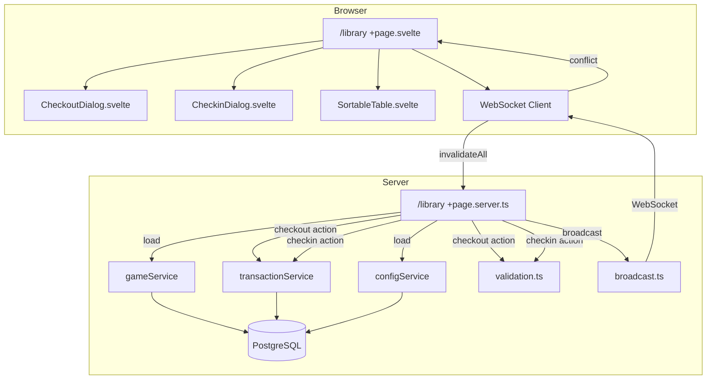

# Design Document: Unified Library Page

## Overview

This feature consolidates the three separate volunteer-facing pages (`/checkout`, `/checkin`, `/catalog`) into a single `/library` page. The unified page displays all non-retired games in one table with contextual action buttons — "Checkout" for available games and "Check In" for checked-out games. Clicking an action button opens a native `<dialog>` popover containing the appropriate form. The feature also simplifies the navigation bar, updates the landing page with a hero image and library CTA, and removes the legacy route files.

### Key Design Decisions

1. **Single page server load with unified query**: A new `gameService.listLibrary()` method returns all non-retired games with checkout info (attendee name, checkout time, checkout weight) joined from the latest checkout transaction. This avoids separate queries for available vs. checked-out games.

2. **Native `<dialog>` for popovers**: Reuses the existing `<dialog>` + `showModal()` pattern from `ConfirmDialog.svelte`. The dialog provides built-in backdrop, focus trapping, and Escape key handling. Two new components — `CheckoutDialog.svelte` and `CheckinDialog.svelte` — encapsulate the forms.

3. **SvelteKit form actions for mutations**: Checkout and check-in submissions use SvelteKit form actions on the `/library` route (`?/checkout` and `?/checkin`), keeping the existing progressive enhancement pattern with `use:enhance`.

4. **WebSocket conflict detection in open popovers**: The existing `wsClient.setOnConflict()` callback is extended so that when a game event arrives for the game currently open in a popover, a `Status_Change_Warning` is shown and the submit button is disabled.

5. **URL-driven state**: All filter, sort, search, and pagination state is stored in URL query parameters, matching the existing pattern in `/catalog`, `/checkout`, and `/checkin`.

## Architecture



### Route Changes

| Action | Route | Notes |
|--------|-------|-------|
| Add | `src/routes/library/+page.server.ts` | Load function + `checkout` and `checkin` form actions |
| Add | `src/routes/library/+page.svelte` | Unified library page component |
| Remove | `src/routes/checkout/` | Entire directory |
| Remove | `src/routes/checkin/` | Entire directory |
| Remove | `src/routes/catalog/` | Entire directory |
| Modify | `src/routes/+page.svelte` | Landing page with hero image + Library CTA |
| Modify | `src/lib/components/Navbar.svelte` | Simplified navigation |
| Modify | `src/lib/stores/websocket.svelte.ts` | Add `/library` to `LIVE_UPDATE_PAGES`, remove old paths |

## Components and Interfaces

### 1. Library Page (`src/routes/library/+page.svelte`)

The main page component orchestrates the table, filters, dialogs, and WebSocket integration.

**Props (from page server load):**
```typescript
interface LibraryPageData {
  games: PaginatedResult<LibraryGameRecord>;
  idTypes: string[];
  weightUnit: string;
  weightTolerance: number;
  lastWeights: Record<number, number>;
  sortField: string;
  sortDir: string;
  activeStatus: string;
  activeGameType: string;
  activeSearch: string;
  activeAttendeeSearch: string;
}
```

**State:**
```typescript
let selectedGame: LibraryGameRecord | null = $state(null);
let dialogMode: 'checkout' | 'checkin' | null = $state(null);
let statusChangeWarning: boolean = $state(false);
```

**Behavior:**
- Renders `SortableTable` with columns: Title, Type, Status, BGG, Attendee, Duration, Weight, Actions.
- Available game rows show "—" for attendee, duration, and weight columns.
- Checked-out game rows show attendee name, checkout duration, and checkout weight.
- Action column shows "Checkout" button for available games, "Check In" button for checked-out games.
- Clicking an action button sets `selectedGame` and `dialogMode`, which opens the corresponding dialog.
- Filter bar includes: Game Title Search (text), Attendee Name Search (text), Status Filter (select), Game Type Filter (select).
- WebSocket `onConflict` handler checks if the event's `gameId` matches `selectedGame?.id` and sets `statusChangeWarning = true`.

**Table Columns:**
```typescript
const columns = [
  { key: 'title', label: 'Title', sortField: 'title' },
  { key: 'type', label: 'Type', sortField: 'game_type' },
  { key: 'status', label: 'Status', sortField: 'status' },
  { key: 'bggId', label: 'BGG', sortField: 'bgg_id' },
  { key: 'attendee', label: 'Attendee' },
  { key: 'duration', label: 'Duration' },
  { key: 'weight', label: 'Weight' },
  { key: 'actions', label: 'Actions', srOnly: true }
];
```

**Filters:**
```typescript
const filters = [
  { key: 'search', label: 'Game Title', type: 'text', placeholder: 'Search by game title...' },
  { key: 'attendeeSearch', label: 'Attendee', type: 'text', placeholder: 'Search by attendee name...' },
  { key: 'status', label: 'Status', type: 'select', options: [
    { value: 'available', label: 'Available' },
    { value: 'checked_out', label: 'Checked Out' }
  ]},
  { key: 'gameType', label: 'Type', type: 'select', options: [
    { value: 'standard', label: 'Standard' },
    { value: 'play_and_win', label: 'Play & Win' },
    { value: 'play_and_take', label: 'Play & Take' }
  ]}
];
```

### 2. Checkout Dialog (`src/lib/components/CheckoutDialog.svelte`)

A `<dialog>` component for the checkout form.

**Props:**
```typescript
interface CheckoutDialogProps {
  open: boolean;
  game: LibraryGameRecord;
  gameDisplayTitle: string;
  idTypes: string[];
  weightUnit: string;
  prefillWeight: string;
  statusChangeWarning: boolean;
  formErrors?: Record<string, string>;
  formValues?: Record<string, unknown>;
  onClose: () => void;
  onSubmit: (formData: FormData) => void;
}
```

**Behavior:**
- Opens via `dialogEl.showModal()` when `open` becomes true.
- Displays game title in the header.
- Contains form fields: attendee first name, attendee last name, ID type (select), checkout weight (prefilled), note (optional).
- Hidden fields: `gameId`, `gameVersion`.
- Cancel button and Escape key close the dialog via `onClose`.
- Clicking outside the dialog (backdrop) closes via `onClose`.
- When `statusChangeWarning` is true, displays a warning banner and disables the submit button.
- Focus is trapped inside the dialog (native `showModal()` behavior).
- On close, focus returns to the triggering button (managed by the parent page storing a ref to the trigger button).

### 3. Check-in Dialog (`src/lib/components/CheckinDialog.svelte`)

A `<dialog>` component for the check-in form.

**Props:**
```typescript
interface CheckinDialogProps {
  open: boolean;
  game: LibraryGameRecord;
  gameDisplayTitle: string;
  weightUnit: string;
  weightTolerance: number;
  statusChangeWarning: boolean;
  formErrors?: Record<string, string>;
  formValues?: Record<string, unknown>;
  onClose: () => void;
  onSubmit: (formData: FormData) => void;
}
```

**Behavior:**
- Opens via `dialogEl.showModal()` when `open` becomes true.
- Displays game title in the header.
- Shows ID return reminder: "Return {attendeeName}'s {idType}".
- Shows raffle reminder for `play_and_win` games.
- Displays checkout weight as reference above the weight input.
- Live weight warning updates as the user types (reuses `getWeightWarningLevel` logic client-side).
- Hidden field: `gameId`.
- For `play_and_take` games, form submission is intercepted to show a `ConfirmDialog` asking if the attendee takes the game. The result sets a hidden `attendeeTakesGame` field before actual submission.
- When `statusChangeWarning` is true, displays a warning banner and disables the submit button.
- Cancel/Escape/backdrop click close via `onClose`.

### 4. Page Server Load (`src/routes/library/+page.server.ts`)

**Load function:**
```typescript
export const load: PageServerLoad = async ({ url }) => {
  // Parse query params: search, attendeeSearch, status, gameType, page, pageSize, sortField, sortDir
  // Build LibraryFilters object
  // Call gameService.listLibrary(filters, pagination, sort)
  // Call configService.getIdTypes()
  // Call configService.get() for weightUnit, weightTolerance
  // Call gameService.getLastWeights(gameIds) for prefill
  // Return all data
};
```

**Form Actions:**
- `checkout`: Same logic as current `/checkout` action — validates with `validateCheckoutInput`, calls `transactionService.checkout`, broadcasts events.
- `checkin`: Same logic as current `/checkin` action — validates with `validateCheckinInput`, calls `transactionService.checkin`, broadcasts events, returns weight warning if applicable.

### 5. Updated Navbar (`src/lib/components/Navbar.svelte`)

**Changes:**
- Remove `primaryLinks` and `secondaryLinks` arrays.
- Replace with three items:
  1. Convention name → `/` (existing brand link)
  2. "Library" → `/library`
  3. Gear icon + "Manage" → `/management`
- The gear icon uses an inline SVG cog icon.
- Mobile hamburger menu is simplified to just show "Library" and "Manage" links.
- Remove Statistics and Config direct links from the navbar (they remain accessible via the Management landing page).

### 6. Updated Landing Page (`src/routes/+page.svelte`)

**Changes:**
- Display convention name as a prominent `<h1>` heading (from layout data).
- Display a hero image banner using `` with `src="/hero.jpg"` (served from `static/hero.jpg`).
- Display a prominent "Browse the Library" CTA button linking to `/library`.
- The hero image uses a placeholder file shipped with the app. Convention runners replace `static/hero.jpg` with their own image.
- Add a comment in the component documenting the hero image path for replacement.

### 7. WebSocket Updates

**`src/lib/stores/websocket.svelte.ts` changes:**
- Update `LIVE_UPDATE_PAGES` to include `/library` and remove `/checkout`, `/checkin`, `/catalog`.
- The `handleEvent` function already handles `invalidate` for live update pages, which triggers `invalidateAll()` to refresh the table data.
- For conflict detection in open popovers: the library page sets `wsClient.setOnConflict()` with a handler that checks if the event's `gameId` matches the currently open dialog's game. If so, it sets `statusChangeWarning = true`.

**Conflict flow:**
1. Volunteer A opens checkout dialog for Game #42.
2. Volunteer B checks out Game #42 from another station.
3. WebSocket broadcasts `game_checked_out` with `gameId: 42`.
4. Volunteer A's client receives the event. `handleEvent` returns `'invalidate'` (table refreshes) AND the `onConflict` callback fires because the page registered a conflict handler.
5. The library page's conflict handler sees `gameId === selectedGame.id`, sets `statusChangeWarning = true`.
6. The dialog shows "This game's status has changed" warning and disables submit.
7. Volunteer A can only close/cancel the dialog.

To support this dual behavior (invalidate the table AND notify the dialog), the `handleEvent` function needs a small adjustment: for `/library`, when a popover is open for the affected game, it should return `'conflict'` but the page should also trigger `invalidateAll()` in its conflict handler. Alternatively, the library page can subscribe to raw WebSocket messages directly. The simpler approach: the library page's `onConflict` handler calls `invalidateAll()` itself in addition to setting the warning flag.

Actually, looking at the existing code more carefully, the `handleEvent` function returns a single action. For the library page, we want both invalidation (table refresh) AND conflict notification. The cleanest approach:

- Keep `handleEvent` returning `'invalidate'` for `/library` (which triggers `debouncer.trigger()` → `invalidateAll()`).
- Add a separate `onGameEvent` callback to the WebSocket client that fires for every game event on live update pages, regardless of the action. The library page uses this to check if the event's `gameId` matches the open dialog's game.

Simpler alternative: modify the WebSocket client's message handler so that on `'invalidate'` action, it also calls `onConflict` if the event has a `gameId`. The library page's `onConflict` handler then checks if the gameId matches and sets the warning. This way, both invalidation and conflict detection happen. This is the approach we'll use — it requires a small change to the WebSocket client's `onmessage` handler to call `onConflict` alongside `debouncer.trigger()` when the action is `'invalidate'` and the event has a `gameId`.

### 8. Service Layer Changes

#### New method: `gameService.listLibrary()`

A unified query that returns all non-retired games with optional checkout info (attendee name, checkout time, checkout weight, ID type) from the latest checkout transaction. This is a LEFT JOIN — available games have null checkout fields.

**Filters supported:**
- `status`: 'available' | 'checked_out' (optional)
- `gameType`: 'standard' | 'play_and_win' | 'play_and_take' (optional)
- `titleSearch`: string (optional, ILIKE on game title)
- `attendeeSearch`: string (optional, ILIKE on attendee first/last name)

**Sort fields supported:**
- `title`, `game_type`, `status`, `bgg_id` (from games table)

**Return type:**
```typescript
interface LibraryGameRecord {
  id: number;
  title: string;
  bggId: number;
  copyNumber: number;
  totalCopies: number;
  status: string;
  gameType: string;
  version: number;
  attendeeFirstName: string | null;
  attendeeLastName: string | null;
  idType: string | null;
  checkoutWeight: number | null;
  checkoutAt: Date | null;
}
```

## Data Models

### LibraryGameRecord

Extends the existing `GameRecord` with checkout transaction fields. No schema changes are needed — this is a query-level join.

```typescript
// Returned by gameService.listLibrary()
interface LibraryGameRecord {
  // From games table
  id: number;
  title: string;
  bggId: number;
  copyNumber: number;
  totalCopies: number;       // Window function: COUNT(*) FILTER (WHERE status != 'retired') OVER (PARTITION BY bgg_id)
  status: string;            // 'available' | 'checked_out'
  gameType: string;          // 'standard' | 'play_and_win' | 'play_and_take'
  version: number;

  // From latest checkout transaction (LEFT JOIN, null for available games)
  attendeeFirstName: string | null;
  attendeeLastName: string | null;
  idType: string | null;
  checkoutWeight: number | null;
  checkoutAt: Date | null;   // Transaction createdAt timestamp
}
```

### URL Query Parameters

| Parameter | Type | Default | Description |
|-----------|------|---------|-------------|
| `search` | string | `''` | Game title search |
| `attendeeSearch` | string | `''` | Attendee name search |
| `status` | `'available' \| 'checked_out'` | `''` (all) | Status filter |
| `gameType` | `'standard' \| 'play_and_win' \| 'play_and_take'` | `''` (all) | Game type filter |
| `sortField` | string | `'title'` | Sort column |
| `sortDir` | `'asc' \| 'desc'` | `'asc'` | Sort direction |
| `page` | number | `1` | Current page |
| `pageSize` | number | `20` | Items per page |

### SQL Query Strategy for `listLibrary()`

```sql
-- Subquery: latest checkout transaction per game (ROW_NUMBER window)
WITH latest_checkout AS (
  SELECT
    game_id,
    attendee_first_name,
    attendee_last_name,
    id_type,
    checkout_weight,
    created_at,
    ROW_NUMBER() OVER (PARTITION BY game_id ORDER BY created_at DESC) AS rn
  FROM transactions
  WHERE type = 'checkout'
)
SELECT
  g.id, g.title, g.bgg_id, g.copy_number,
  COUNT(*) FILTER (WHERE g.status != 'retired') OVER (PARTITION BY g.bgg_id) AS total_copies,
  g.status, g.game_type, g.version,
  lc.attendee_first_name, lc.attendee_last_name, lc.id_type,
  lc.checkout_weight, lc.created_at AS checkout_at
FROM games g
LEFT JOIN latest_checkout lc ON g.id = lc.game_id AND lc.rn = 1
WHERE g.status != 'retired'
  -- Optional filters applied here
ORDER BY g.title ASC
LIMIT :pageSize OFFSET :offset;
```

This mirrors the existing `listCheckedOut()` approach but uses a LEFT JOIN instead of INNER JOIN so available games are included.

### Hero Image

- **File path**: `static/hero.jpg`
- **Aspect ratio**: ~3:1 or 4:1 (wide banner)
- **Placeholder**: A simple gradient image or generic board game illustration, generated as part of the implementation task.
- **Documentation**: A comment in `+page.svelte` and a note in the project README explaining the path.


## Correctness Properties

*A property is a characteristic or behavior that should hold true across all valid executions of a system — essentially, a formal statement about what the system should do. Properties serve as the bridge between human-readable specifications and machine-verifiable correctness guarantees.*

### Property 1: Unified listing returns all non-retired games with correct checkout fields

*For any* set of games in the database with mixed statuses (available, checked_out, retired), calling `listLibrary()` with default parameters SHALL return exactly the non-retired games sorted by title ascending, where every available game has null attendee/checkout fields and every checked-out game has non-null attendee name and checkout timestamp from its latest checkout transaction.

**Validates: Requirements 1.1, 1.3, 2.4**

### Property 2: Sort correctness

*For any* set of non-retired games and any valid sort field (`title`, `game_type`, `status`, `bgg_id`) with any direction (`asc`, `desc`), calling `listLibrary()` SHALL return results ordered according to the specified field and direction.

**Validates: Requirements 1.4**

### Property 3: Pagination correctness

*For any* set of non-retired games and any valid page number and page size, calling `listLibrary()` SHALL return a subset of size at most `pageSize`, the correct `total` count of all matching games, and the items corresponding to the requested page offset.

**Validates: Requirements 1.5**

### Property 4: Title search filter correctness

*For any* non-empty search string and any set of games, calling `listLibrary()` with a `titleSearch` filter SHALL return only games whose title contains the search string (case-insensitive), and SHALL return all such matching non-retired games.

**Validates: Requirements 1.6**

### Property 5: Attendee name search filter correctness

*For any* non-empty search string and any set of checked-out games with attendee names, calling `listLibrary()` with an `attendeeSearch` filter SHALL return only games where the attendee first name or last name contains the search string (case-insensitive).

**Validates: Requirements 1.7**

### Property 6: Status filter correctness

*For any* status filter value (`available` or `checked_out`) and any set of non-retired games, calling `listLibrary()` with that status filter SHALL return only games whose status matches the filter value, and SHALL return all such matching games.

**Validates: Requirements 2.2, 2.3**

### Property 7: Weight warning level classification

*For any* positive checkout weight, positive check-in weight, and positive tolerance, `getWeightWarningLevel()` SHALL return `'red'` when the absolute difference exceeds the tolerance, `'yellow'` when the difference is between 2% of checkout weight and the tolerance, and `'none'` when the difference is within 2% of checkout weight.

**Validates: Requirements 6.1, 6.2, 6.3, 6.4**

### Property 8: WebSocket event handling for /library page

*For any* game event type (`game_checked_out`, `game_checked_in`, `game_created`, `game_updated`, `game_deleted`, `game_retired`, `game_restored`) with any gameId, calling `handleEvent()` with pathname `/library` SHALL return `'invalidate'`.

**Validates: Requirements 9.2**

### Property 9: Conflict detection matches open dialog game

*For any* game event with a `gameId` field, when a popover dialog is open for a game with a specific ID, the conflict detection logic SHALL flag a status change warning if and only if the event's `gameId` equals the open dialog's game ID.

**Validates: Requirements 9.4**

## Error Handling

### Form Action Errors

| Scenario | HTTP Status | Response Shape | UI Behavior |
|----------|-------------|----------------|-------------|
| Validation failure (checkout) | 400 | `{ errors: Record<string, string>, values }` | Field-level error messages in dialog, form values preserved |
| Validation failure (checkin) | 400 | `{ errors: Record<string, string>, values, gameId }` | Field-level error messages in dialog, form values preserved |
| Optimistic locking conflict (checkout) | 409 | `{ conflict: true, message }` | Toast error notification, dialog closes |
| Game no longer checked out (checkin) | 409 | `{ conflict: true, message }` | Toast error notification, dialog closes |
| Unexpected server error | 500 | `{ error: string }` | Toast error notification |

### WebSocket Errors

- **Connection lost**: `ConnectionIndicator` shows disconnected state. Automatic reconnection with exponential backoff (existing behavior).
- **Reconnection**: On reconnect, `invalidateAll()` refreshes the table data (existing behavior).
- **Invalid message**: Logged and ignored (existing behavior).

### Dialog Error States

- **Status change warning**: When a WebSocket event indicates the game's status changed while a dialog is open, the dialog shows a warning banner ("This game's status has changed. Please close and try again.") and disables the submit button. Only cancel/close actions remain available.
- **Form submission during warning**: Not possible — submit button is disabled.

### Edge Cases

- **Game retired while dialog is open**: The `game_retired` event triggers the status change warning in the dialog.
- **Multiple rapid events**: The debouncer coalesces multiple `invalidateAll()` calls within 300ms (existing behavior).
- **Dialog open during page data refresh**: The dialog component uses local state for form values, so `invalidateAll()` refreshing the table data does not reset the dialog form. The `selectedGame` reference is updated from the refreshed data via an `$effect` that finds the matching game by ID.

## Testing Strategy

### Property-Based Tests (Vitest + fast-check)

Location: `tests/properties/library.prop.test.ts`

These tests validate the core domain logic properties identified in the Correctness Properties section. Each test uses `fc.assert(fc.property(...))` with a minimum of 100 iterations.

| Property | What's Tested | Approach |
|----------|---------------|----------|
| Property 1: Unified listing | `gameService.listLibrary()` returns correct games with correct fields | Generate random game sets, insert into test DB, call listLibrary, verify results |
| Property 2: Sort correctness | Results are ordered by the specified field/direction | Generate games, call with each sort field, verify ordering |
| Property 3: Pagination | Correct subset and total count | Generate games, call with various page/pageSize, verify subset |
| Property 4: Title search | Only title-matching games returned | Generate games with random titles, search with substring, verify all results match |
| Property 5: Attendee search | Only attendee-matching games returned | Generate checked-out games, search by attendee name substring, verify matches |
| Property 6: Status filter | Only status-matching games returned | Generate mixed-status games, filter by status, verify all results match |
| Property 7: Weight warning | Correct warning level classification | Generate random weights and tolerances, verify getWeightWarningLevel output |
| Property 8: WS event handling | handleEvent returns 'invalidate' for /library | Generate random game events, call handleEvent with '/library', verify result |
| Property 9: Conflict detection | Warning triggered iff gameId matches | Generate random event gameIds and dialog gameIds, verify match logic |

**Note:** Property 7 (weight warning) already has existing tests in the codebase. The new test file should focus on Properties 1-6 (service layer) and 8-9 (WebSocket logic). Property 7 can be included for completeness or skipped if already covered.

**Configuration:**
- Library: `fast-check` (already in dependencies)
- Runner: `vitest run`
- Tag format: `Feature: unified-library-page, Property N: {description}`

### Unit Tests (Vitest)

Example-based tests for specific scenarios not covered by property tests:

- Checkout dialog renders correct fields and prefills weight
- Check-in dialog shows ID return reminder with correct attendee info
- Check-in dialog shows raffle reminder for play_and_win games
- Available game rows show "—" placeholders
- Action buttons render correctly based on game status
- Focus returns to trigger button after dialog close

### Integration / E2E Tests (Playwright)

Full user flow tests against the running application:

- Complete checkout flow: browse → click checkout → fill form → submit → verify success
- Complete check-in flow: filter checked out → click check in → fill form → submit → verify success
- Play & Take confirmation dialog flow
- Conflict handling: concurrent checkout from two stations
- Filter persistence across page refresh
- Navigation: landing page CTA → library, navbar links
- Legacy routes return 404
- WebSocket live update: check out on one tab, verify table updates on another

### Test File Structure

```
tests/
├── properties/
│   ├── library.prop.test.ts          # Properties 1-6 (service layer)
│   ├── library-websocket.prop.test.ts # Properties 8-9 (WebSocket logic)
│   └── weight-warning.prop.test.ts    # Property 7 (if not already covered)
└── integration/
    └── library.test.ts               # E2E flows for the unified library page
```
